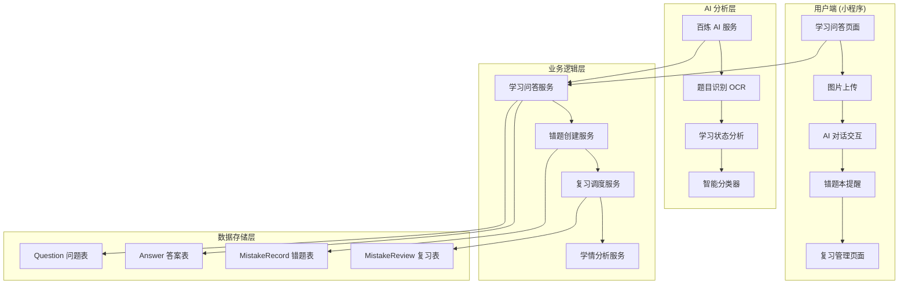

# 五好伴学 AI 驱动错题本系统 - 开发指引文档

> **文档版本**: v2.0  
> **创建时间**: 2025-10-25  
> **设计理念**: 从作业问答自动生成，AI 智能驱动的错题本系统  
> **预期完成**: 2025-12-31

---

## 📋 目录

- [核心设计理念](#核心设计理念)
- [系统架构设计](#系统架构设计)
- [技术实现路线](#技术实现路线)
- [开发阶段规划](#开发阶段规划)
- [具体实现方案](#具体实现方案)
- [测试验证标准](#测试验证标准)
- [部署运维指南](#部署运维指南)

---

## 🎯 核心设计理念

### 业务模式转换

```
传统错题本 (手动管理)          →    AI 驱动错题本 (智能管理)
├─ 手动添加错题               →    ├─ 作业问答自动识别
├─ 人工分类整理               →    ├─ AI 智能分类筛选
├─ 简单复习提醒               →    ├─ 个性化复习调度
└─ 静态学习记录               →    └─ 动态学习轨迹分析
```

### 数据来源重新定义

#### 🔍 主要来源：作业问答模块

1. **图片上传题目** - 用户通过小程序上传作业图片
2. **AI 识别分析** - 百炼 AI 识别题目内容和学习状态
3. **智能分类筛选** - 自动判断是否需要加入错题本

#### 📊 错题类型分类

- **空题 (Empty Question)**: 学生完全不会做的题目
- **错题 (Wrong Answer)**: 学生答错的题目
- **难题 (Hard Question)**: 学生感到困难的题目

#### 🎯 业务价值

- **学习轨迹沉淀**: 将学习过程中的难点自动记录
- **个性化复习**: 基于艾宾浩斯遗忘曲线的智能复习计划
- **学习效果量化**: 通过复习数据分析学习成效

---

## 🏗️ 系统架构设计

### 整体架构图



### 核心数据模型

#### 1. 扩展错题记录模型

```python
# src/models/study.py - MistakeRecord 扩展
class MistakeRecord(BaseModel):
    # 新增字段
    category = Column(String(20), nullable=False, comment="错题类型: empty_question|wrong_answer|hard_question")
    ai_analysis = Column(JSON, nullable=True, comment="AI分析结果")
    auto_created = Column(Boolean, default=True, comment="是否自动创建")
    learning_context = Column(JSON, nullable=True, comment="学习上下文信息")
    mistake_pattern = Column(String(50), nullable=True, comment="错误模式标识")

    # 原有字段保持不变
    source = Column(String(50), default="learning", comment="来源：learning(作业问答)")
    source_question_id = Column(UUID, nullable=False, comment="关联的Question ID")
```

#### 2. AI 分析结果结构

```python
# AI 分析返回的 JSON 结构
ai_analysis = {
    "classification": {
        "category": "empty_question",  # 分类结果
        "confidence": 0.95,            # 置信度
        "reasoning": "学生表示完全不知道解题思路" # 分类原因
    },
    "knowledge_analysis": {
        "knowledge_points": ["二次函数", "函数图像"],
        "difficulty_level": 3,
        "prerequisite_knowledge": ["一次函数", "坐标系"]
    },
    "learning_suggestion": {
        "review_priority": "high",     # 复习优先级
        "suggested_interval": 1,       # 建议复习间隔(天)
        "related_concepts": ["配方法", "顶点坐标"]
    }
}
```

### 服务层架构

#### 1. 学习问答服务增强

```python
# src/services/learning_service.py
class LearningService:
    async def ask_question(self, user_id: str, request: AskQuestionRequest):
        # 1. 原有问答逻辑
        question = await self._save_question(user_id, session_id, request)
        answer = await self._get_ai_response(context, question)

        # 2. 🆕 智能错题分析
        mistake_analysis = await self._analyze_mistake_potential(question, answer)

        # 3. 🆕 自动创建错题记录
        mistake_id = None
        if mistake_analysis['should_create_mistake']:
            mistake_id = await self._auto_create_mistake(user_id, question, mistake_analysis)

        return AskQuestionResponse(
            question=question,
            answer=answer,
            mistake_created=mistake_id is not None,
            mistake_info=mistake_analysis if mistake_id else None
        )
```

#### 2. 智能错题分析器

```python
# src/services/mistake_analyzer.py
class MistakeAnalyzer:
    """AI 驱动的错题智能分析器"""

    async def analyze_mistake_potential(self, question: Question, answer: Answer) -> Dict:
        """分析是否需要创建错题记录"""

        # 1. 构建分析提示词
        analysis_prompt = self._build_analysis_prompt(question, answer)

        # 2. 调用 AI 分析
        ai_response = await self.bailian_service.analyze_learning_status(analysis_prompt)

        # 3. 解析分析结果
        return self._parse_analysis_result(ai_response)

    def _build_analysis_prompt(self, question: Question, answer: Answer) -> str:
        return f"""
        你是一个专业的学习分析师，请分析以下学习场景：

        学生问题：{question.content}
        学生交互：{answer.content if answer else "无回答"}

        请判断：
        1. 题目类型：空题(不会做) / 错题(答错了) / 难题(有困难) / 已掌握
        2. 是否需要加入错题本进行复习
        3. 知识点提取和难度评估
        4. 个性化学习建议

        返回 JSON 格式：
        {{
            "category": "empty_question|wrong_answer|hard_question|mastered",
            "should_create_mistake": true/false,
            "confidence": 0.95,
            "reasoning": "详细分析原因",
            "knowledge_points": ["知识点1", "知识点2"],
            "difficulty_level": 1-5,
            "learning_suggestions": ["建议1", "建议2"]
        }}
        """
```

---

## 🚀 技术实现路线

### Phase 1: AI 分析引擎 (Week 1-2)

#### 任务 1.1: 扩展 AI Prompt 系统

```python
# src/services/bailian_service.py - 新增方法
class BailianService:
    async def analyze_learning_status(self, analysis_prompt: str) -> Dict:
        """专用于学习状态分析的 AI 调用"""

        messages = [
            {"role": "system", "content": self.LEARNING_ANALYZER_SYSTEM_PROMPT},
            {"role": "user", "content": analysis_prompt}
        ]

        response = await self._call_bailian_api(messages, temperature=0.1)  # 低温度保证一致性

        # 解析 JSON 响应
        return self._safe_json_parse(response.content)

    LEARNING_ANALYZER_SYSTEM_PROMPT = """
    你是五好伴学的AI学习分析师，专门分析K12学生的学习状态。

    核心任务：
    1. 准确识别学生的学习困难点
    2. 判断是否需要加入错题本复习
    3. 提供个性化学习建议

    分析标准：
    - 空题：学生明确表示不会或请求详细讲解
    - 错题：学生给出错误答案或思路有误
    - 难题：学生能做但感到困难或耗时过长
    - 已掌握：学生理解正确，仅需确认

    返回格式必须是有效的JSON，字段完整。
    """
```

#### 任务 1.2: 数据库模型扩展

```sql
-- alembic migration: 扩展错题记录表
ALTER TABLE mistake_records ADD COLUMN category VARCHAR(20) NOT NULL DEFAULT 'wrong_answer';
ALTER TABLE mistake_records ADD COLUMN ai_analysis JSON;
ALTER TABLE mistake_records ADD COLUMN auto_created BOOLEAN DEFAULT TRUE;
ALTER TABLE mistake_records ADD COLUMN learning_context JSON;
ALTER TABLE mistake_records ADD COLUMN mistake_pattern VARCHAR(50);

-- 添加索引
CREATE INDEX idx_mistake_category ON mistake_records(category);
CREATE INDEX idx_mistake_auto_created ON mistake_records(auto_created);
CREATE INDEX idx_mistake_pattern ON mistake_records(mistake_pattern);
```

#### 任务 1.3: 错题自动创建服务

```python
# src/services/mistake_auto_creator.py
class MistakeAutoCreator:
    """错题自动创建服务"""

    async def create_from_learning_analysis(
        self,
        user_id: str,
        question: Question,
        ai_analysis: Dict
    ) -> Optional[str]:
        """基于AI分析结果自动创建错题"""

        # 1. 验证是否需要创建
        if not ai_analysis.get('should_create_mistake', False):
            return None

        # 2. 构建错题数据
        mistake_data = {
            "user_id": user_id,
            "source": "learning",
            "source_question_id": question.id,
            "category": ai_analysis['category'],
            "ai_analysis": ai_analysis,
            "auto_created": True,

            # 从问题中提取
            "subject": question.subject or "其他",
            "title": self._generate_title(question.content),
            "ocr_text": question.content,
            "image_urls": json.loads(question.image_urls) if question.image_urls else [],

            # 从AI分析中提取
            "difficulty_level": ai_analysis.get('difficulty_level', 2),
            "knowledge_points": ai_analysis.get('knowledge_points', []),

            # 复习调度
            "mastery_status": "not_mastered",
            "next_review_at": self._calculate_first_review_time(ai_analysis),
            "review_count": 0,
            "correct_count": 0,
        }

        # 3. 创建错题记录
        mistake = await self.mistake_repo.create(mistake_data)

        # 4. 记录创建日志
        logger.info(f"Auto-created mistake: {mistake.id} from question: {question.id}")

        return str(mistake.id)
```

### Phase 2: 小程序端集成 (Week 3-4)

#### 任务 2.1: 学习问答页面增强

```javascript
// miniprogram/pages/learning/index/index.js
async sendMessage(inputText) {
  try {
    // 原有发送逻辑...
    const response = await api.learning.askQuestion(requestParams);

    // 🆕 处理错题自动创建结果
    if (response.mistake_created) {
      this.handleMistakeAutoCreated(response.mistake_info);
    }

    // 显示AI回复...

  } catch (error) {
    // 错误处理...
  }
},

handleMistakeAutoCreated(mistakeInfo) {
  console.log('自动创建错题:', mistakeInfo);

  // 显示温和提示，不打断学习流程
  this.setData({
    showMistakeHint: true,
    mistakeHintInfo: {
      category: mistakeInfo.category,
      categoryText: this.getCategoryText(mistakeInfo.category),
      nextReviewDate: this.formatDate(mistakeInfo.next_review_date),
      mistakeId: mistakeInfo.id
    }
  });

  // 3秒后自动隐藏提示
  setTimeout(() => {
    this.setData({ showMistakeHint: false });
  }, 3000);
},

getCategoryText(category) {
  const categoryMap = {
    'empty_question': '这道题已加入错题本 - 不会做的题',
    'wrong_answer': '这道题已加入错题本 - 答错的题',
    'hard_question': '这道题已加入错题本 - 有难度的题'
  };
  return categoryMap[category] || '已加入错题本';
}
```

#### 任务 2.2: 错题本页面重构

```javascript
// miniprogram/pages/mistakes/list/index.js - 重构
data: {
  // 移除手动添加相关状态
  // showAddModal: false,  // 删除
  // addFormData: {},      // 删除

  // 新增智能筛选
  categoryFilter: 'all',
  categoryOptions: [
    { label: '全部', value: 'all' },
    { label: '不会做的题', value: 'empty_question' },
    { label: '答错的题', value: 'wrong_answer' },
    { label: '有难度的题', value: 'hard_question' }
  ],

  // 新增来源筛选
  sourceFilter: 'all',
  sourceOptions: [
    { label: '全部来源', value: 'all' },
    { label: '作业问答', value: 'learning' },
    { label: '手动添加', value: 'manual' }  // 兼容历史数据
  ],

  // 智能推荐
  recommendedReviews: [],    // AI推荐的复习题目
  learningInsights: null,    // 学习洞察报告
}

// 移除手动添加方法，专注于智能管理
// onAddMistake() {}  // 删除
// showAddModal() {}  // 删除

// 新增智能分析方法
async loadLearningInsights() {
  try {
    const insights = await mistakesApi.getLearningInsights();
    this.setData({
      learningInsights: insights.data,
      recommendedReviews: insights.data.recommended_reviews || []
    });
  } catch (error) {
    console.error('加载学习洞察失败:', error);
  }
}
```

### Phase 3: 智能分析系统 (Week 5-6)

#### 任务 3.1: 学习模式分析器

```python
# src/services/learning_pattern_analyzer.py
class LearningPatternAnalyzer:
    """学习模式分析器"""

    async def analyze_user_patterns(self, user_id: str) -> Dict:
        """分析用户学习模式"""

        # 1. 错题来源分析
        source_stats = await self._analyze_mistake_sources(user_id)

        # 2. 知识点薄弱分析
        weak_points = await self._identify_weak_knowledge_points(user_id)

        # 3. 学习习惯分析
        learning_habits = await self._analyze_learning_habits(user_id)

        # 4. 复习效果分析
        review_effectiveness = await self._analyze_review_effectiveness(user_id)

        return {
            'source_distribution': source_stats,
            'weak_knowledge_points': weak_points,
            'learning_habits': learning_habits,
            'review_effectiveness': review_effectiveness,
            'personalized_suggestions': self._generate_suggestions(weak_points, learning_habits)
        }

    async def _analyze_mistake_sources(self, user_id: str) -> Dict:
        """分析错题来源分布"""
        query = """
        SELECT category, COUNT(*) as count
        FROM mistake_records
        WHERE user_id = :user_id AND deleted_at IS NULL
        GROUP BY category
        """

        result = await self.db.execute(text(query), {"user_id": user_id})

        total = sum(row[1] for row in result)
        distribution = {
            row[0]: {
                'count': row[1],
                'percentage': round(row[1] / total * 100, 1) if total > 0 else 0
            }
            for row in result
        }

        return {
            'total_mistakes': total,
            'distribution': distribution,
            'insights': self._interpret_source_distribution(distribution)
        }

    def _generate_suggestions(self, weak_points: List, habits: Dict) -> List[str]:
        """生成个性化学习建议"""
        suggestions = []

        # 基于薄弱知识点的建议
        if weak_points:
            suggestions.append(f"重点复习：{', '.join(weak_points[:3])}等知识点")

        # 基于学习习惯的建议
        if habits.get('review_consistency', 0) < 0.7:
            suggestions.append("建议保持每日复习习惯，提高学习一致性")

        if habits.get('mistake_reduction_rate', 0) < 0.5:
            suggestions.append("错题重现率较高，建议增加复习频次")

        return suggestions
```

#### 任务 3.2: 个性化复习调度器

```python
# src/services/personalized_scheduler.py
class PersonalizedScheduler:
    """个性化复习调度器"""

    async def optimize_review_schedule(self, user_id: str) -> List[Dict]:
        """优化个人复习计划"""

        # 1. 获取用户学习数据
        user_patterns = await self.pattern_analyzer.analyze_user_patterns(user_id)

        # 2. 获取待复习错题
        pending_reviews = await self._get_pending_reviews(user_id)

        # 3. 应用个性化算法
        optimized_schedule = []
        for mistake in pending_reviews:
            # 根据个人遗忘曲线调整间隔
            personalized_interval = self._calculate_personalized_interval(
                mistake, user_patterns
            )

            # 根据知识点重要度调整优先级
            priority_score = self._calculate_priority_score(
                mistake, user_patterns['weak_knowledge_points']
            )

            optimized_schedule.append({
                'mistake_id': mistake.id,
                'original_date': mistake.next_review_at,
                'optimized_date': personalized_interval,
                'priority_score': priority_score,
                'optimization_reason': self._explain_optimization(mistake, user_patterns)
            })

        # 4. 按优先级排序
        optimized_schedule.sort(key=lambda x: x['priority_score'], reverse=True)

        return optimized_schedule
```

### Phase 4: 前端体验优化 (Week 7-8)

#### 任务 4.1: 智能提示系统

```javascript
// miniprogram/components/mistake-smart-hint/index.js
Component({
  properties: {
    mistakeInfo: {
      type: Object,
      value: null,
    },
    visible: {
      type: Boolean,
      value: false,
    },
  },

  data: {
    animationData: {},
  },

  methods: {
    onViewMistake() {
      wx.navigateTo({
        url: `/pages/mistakes/detail/index?id=${this.data.mistakeInfo.id}`,
      })
      this.triggerEvent('close')
    },

    onDismiss() {
      this.triggerEvent('close')
    },

    showAnimation() {
      const animation = wx.createAnimation({
        duration: 300,
        timingFunction: 'ease-out',
      })

      animation.translateY(0).opacity(1).step()
      this.setData({
        animationData: animation.export(),
      })
    },
  },
})
```

#### 任务 4.2: 学习洞察可视化

```javascript
// miniprogram/pages/mistakes/insights/index.js
Page({
  data: {
    insights: null,
    loading: true,

    // 图表数据
    sourceDistribution: [],
    weaknessRadar: [],
    reviewTrend: [],

    // 个性化建议
    suggestions: [],
    nextReviewPriority: [],
  },

  async onLoad() {
    await this.loadInsights()
    this.initCharts()
  },

  async loadInsights() {
    try {
      const response = await api.mistakes.getLearningInsights()
      this.setData({
        insights: response.data,
        sourceDistribution: this.formatSourceData(response.data),
        suggestions: response.data.personalized_suggestions,
      })
    } catch (error) {
      console.error('加载学习洞察失败:', error)
    } finally {
      this.setData({ loading: false })
    }
  },

  initCharts() {
    // 使用 echarts-for-weixin 初始化图表
    this.initSourceChart()
    this.initWeaknessRadar()
    this.initReviewTrend()
  },
})
```

---

## 🧪 测试验证标准

### 自动化测试覆盖

#### 1. AI 分析准确性测试

```python
# tests/services/test_mistake_analyzer.py
class TestMistakeAnalyzer:
    """错题分析器测试"""

    @pytest.mark.asyncio
    async def test_empty_question_detection(self):
        """测试空题检测准确性"""
        test_cases = [
            {
                'question': '这道题我完全不会做，请详细讲解',
                'expected_category': 'empty_question',
                'expected_confidence': 0.9
            },
            # 更多测试用例...
        ]

        for case in test_cases:
            result = await self.analyzer.analyze_mistake_potential(
                create_mock_question(case['question']),
                None
            )

            assert result['category'] == case['expected_category']
            assert result['confidence'] >= case['expected_confidence']

    @pytest.mark.asyncio
    async def test_auto_creation_logic(self):
        """测试自动创建逻辑"""
        # 应该创建错题的情况
        should_create_cases = [
            "我不知道这道题怎么做",
            "我的答案是A，但正确答案是B",
            "这道题太难了，看不懂"
        ]

        # 不应该创建错题的情况
        should_not_create_cases = [
            "我知道答案是A，请确认一下",
            "这道题我会做，答案是B",
            "请检查我的解题过程是否正确"
        ]

        # 执行测试...
```

#### 2. 复习效果验证测试

```python
# tests/services/test_review_effectiveness.py
class TestReviewEffectiveness:
    """复习效果验证测试"""

    @pytest.mark.asyncio
    async def test_mastery_progression(self):
        """测试掌握度提升轨迹"""

        # 模拟复习序列
        review_sequence = [
            {'result': 'incorrect', 'expected_status': 'not_mastered'},
            {'result': 'correct', 'expected_status': 'reviewing'},
            {'result': 'correct', 'expected_status': 'reviewing'},
            {'result': 'correct', 'expected_status': 'mastered'}
        ]

        mistake = await self.create_test_mistake()

        for review in review_sequence:
            await self.mistake_service.complete_review(
                mistake.id, review['result']
            )

            updated_mistake = await self.mistake_repo.get_by_id(mistake.id)
            assert updated_mistake.mastery_status == review['expected_status']
```

### 性能基准测试

#### 1. AI 分析响应时间

```python
# 目标：AI分析响应时间 < 3秒 (P95)
@pytest.mark.performance
async def test_ai_analysis_performance():
    start_time = time.time()

    result = await mistake_analyzer.analyze_mistake_potential(question, answer)

    response_time = time.time() - start_time
    assert response_time < 3.0, f"AI分析耗时过长: {response_time}s"
```

#### 2. 错题创建并发测试

```python
# 目标：支持 100 并发错题创建
@pytest.mark.performance
async def test_concurrent_mistake_creation():
    tasks = []
    for i in range(100):
        task = mistake_auto_creator.create_from_learning_analysis(
            f"user_{i}", create_mock_question(), create_mock_analysis()
        )
        tasks.append(task)

    results = await asyncio.gather(*tasks, return_exceptions=True)

    success_count = sum(1 for r in results if not isinstance(r, Exception))
    assert success_count >= 95, f"并发创建成功率过低: {success_count}/100"
```

### 用户体验测试

#### 1. 小程序端集成测试

```javascript
// tests/miniprogram/test_mistake_integration.js
describe('错题本小程序集成测试', () => {
  it('应该在学习问答后显示错题提示', async () => {
    // 模拟发送消息
    await tester.sendMessage('这道题我不会做')

    // 验证是否显示错题提示
    const mistakeHint = await tester.findElement('.mistake-hint')
    expect(mistakeHint).toBeTruthy()

    // 验证提示内容
    const hintText = await mistakeHint.getText()
    expect(hintText).toContain('已加入错题本')
  })

  it('应该正确跳转到错题详情页', async () => {
    await tester.clickElement('.mistake-hint .view-button')

    const currentPage = await tester.getCurrentPage()
    expect(currentPage.route).toBe('pages/mistakes/detail/index')
  })
})
```

---

## 📊 关键指标监控

### 业务指标

| 指标名称       | 目标值 | 监控方式     | 告警阈值     |
| -------------- | ------ | ------------ | ------------ |
| AI 分析准确率  | ≥85%   | 每日批量验证 | <80%         |
| 错题自动创建率 | 60-80% | 实时统计     | <50% 或 >90% |
| 复习完成率     | ≥70%   | 每周统计     | <60%         |
| 掌握度提升率   | ≥60%   | 每月分析     | <50%         |

### 技术指标

| 指标名称        | 目标值     | 监控方式   | 告警阈值 |
| --------------- | ---------- | ---------- | -------- |
| AI 分析响应时间 | P95 <3s    | APM 监控   | P95 >5s  |
| 错题创建成功率  | ≥99%       | 日志监控   | <95%     |
| 数据库查询时间  | P95 <500ms | 慢查询日志 | P95 >1s  |
| 接口可用性      | ≥99.9%     | 健康检查   | <99%     |

### 监控实现

```python
# src/core/metrics.py
class MistakeMetrics:
    """错题本系统指标收集"""

    @staticmethod
    def record_ai_analysis(duration: float, accuracy: float, category: str):
        """记录AI分析指标"""
        metrics.histogram('mistake_ai_analysis_duration', duration, tags={'category': category})
        metrics.gauge('mistake_ai_analysis_accuracy', accuracy, tags={'category': category})

    @staticmethod
    def record_auto_creation(success: bool, category: str, user_id: str):
        """记录自动创建指标"""
        metrics.increment('mistake_auto_creation_total', tags={
            'success': str(success).lower(),
            'category': category
        })

    @staticmethod
    def record_review_completion(mistake_id: str, result: str, improvement: float):
        """记录复习完成指标"""
        metrics.increment('mistake_review_completed', tags={'result': result})
        metrics.gauge('mistake_mastery_improvement', improvement)
```

---

## 🚀 部署运维指南

### 数据库迁移

```bash
# 1. 执行新的数据库迁移
alembic upgrade head

# 2. 验证新字段
python -c "
from src.models.study import MistakeRecord
from src.core.database import engine
import asyncio

async def check_schema():
    async with engine.begin() as conn:
        result = await conn.execute('DESCRIBE mistake_records')
        columns = [row[0] for row in result]
        required = ['category', 'ai_analysis', 'auto_created']
        missing = [col for col in required if col not in columns]
        print(f'Missing columns: {missing}' if missing else 'Schema check passed')

asyncio.run(check_schema())
"

# 3. 创建必要索引
python scripts/create_mistake_indexes.py
```

### 配置更新

```yaml
# config/production.yml
ai_analysis:
  enable_auto_creation: true
  confidence_threshold: 0.7
  max_daily_creations_per_user: 50

mistake_categories:
  empty_question:
    initial_review_days: 1
    priority_weight: 1.0
  wrong_answer:
    initial_review_days: 1
    priority_weight: 0.8
  hard_question:
    initial_review_days: 2
    priority_weight: 0.6

performance:
  ai_analysis_timeout: 30s
  batch_analysis_size: 10
  concurrent_creations: 5
```

### 监控部署

```bash
# 1. 部署 Prometheus 监控
kubectl apply -f monitoring/prometheus-mistake-rules.yaml

# 2. 配置 Grafana 面板
grafana-cli plugins install grafana-piechart-panel
# 导入 monitoring/grafana-mistake-dashboard.json

# 3. 设置告警规则
kubectl apply -f monitoring/alerting-rules.yaml
```

### 性能优化

```python
# src/core/optimization.py
class MistakeOptimization:
    """错题本性能优化"""

    @staticmethod
    async def optimize_batch_analysis(questions: List[Question]) -> List[Dict]:
        """批量AI分析优化"""

        # 1. 按相似度分组
        groups = group_similar_questions(questions)

        # 2. 并行处理每组
        tasks = []
        for group in groups:
            task = analyze_question_group(group)
            tasks.append(task)

        results = await asyncio.gather(*tasks)

        # 3. 展平结果
        return [item for sublist in results for item in sublist]

    @staticmethod
    def cache_frequent_analyses():
        """缓存常见分析结果"""
        # 实现智能缓存逻辑
        pass
```

---

## 📋 开发检查清单

### Phase 1 完成标准

- [ ] AI 分析引擎开发完成，准确率 ≥80%
- [ ] 数据库模型扩展，支持新字段
- [ ] 自动创建服务，成功率 ≥95%
- [ ] 单元测试覆盖率 ≥85%

### Phase 2 完成标准

- [ ] 小程序学习问答页面集成
- [ ] 错题本列表页面重构
- [ ] 智能提示组件开发
- [ ] 集成测试通过

### Phase 3 完成标准

- [ ] 学习模式分析器开发
- [ ] 个性化复习调度器
- [ ] 数据洞察 API 完成
- [ ] 性能测试达标

### Phase 4 完成标准

- [ ] 前端体验优化完成
- [ ] 学习洞察可视化
- [ ] 用户体验测试通过
- [ ] 生产环境部署成功

---

## 🔮 未来扩展规划

### 中期扩展 (3-6 个月)

#### 1. 多模态学习分析

```python
# 支持语音、手写等多种输入方式
class MultimodalAnalyzer:
    async def analyze_voice_question(self, audio_url: str) -> Dict:
        """分析语音提问"""
        pass

    async def analyze_handwriting(self, image_url: str) -> Dict:
        """分析手写解答"""
        pass
```

#### 2. 社交化学习

```python
# 错题分享和协作学习
class SocialLearning:
    async def share_mistake_solution(self, mistake_id: str, solution: str):
        """分享错题解决方案"""
        pass

    async def get_peer_help(self, mistake_id: str) -> List[str]:
        """获取同学帮助"""
        pass
```

### 长期愿景 (6-12 个月)

#### 1. 知识图谱构建

- 构建个人知识掌握图谱
- 识别知识点之间的依赖关系
- 生成个性化学习路径

#### 2. 预测性学习分析

- 预测学习困难点
- 提前推荐相关练习
- 预防性错题干预

---

## 🎯 结语

这份开发指引文档详细描述了五好伴学 AI 驱动错题本系统的设计理念、技术实现和开发路线。通过将错题本从传统的手动管理模式升级为 AI 智能驱动的学习伴侣，我们期望能够：

1. **提升学习效率** - 自动识别学习难点，减少手动管理负担
2. **个性化学习** - 基于个人学习数据提供精准的复习建议
3. **量化学习效果** - 通过数据分析验证学习成果
4. **智能化体验** - 让 AI 成为学生真正的学习伙伴

请按照文档中的阶段规划逐步实施，确保每个阶段的质量标准，为学生提供更智能、更有效的学习支持。

---

**文档维护**: 请在开发过程中及时更新此文档，记录实际实现与设计的差异。  
**技术支持**: 如有疑问请联系开发团队进行澄清和讨论。  
**版本控制**: 重大设计变更请更新文档版本号并记录变更日志。
