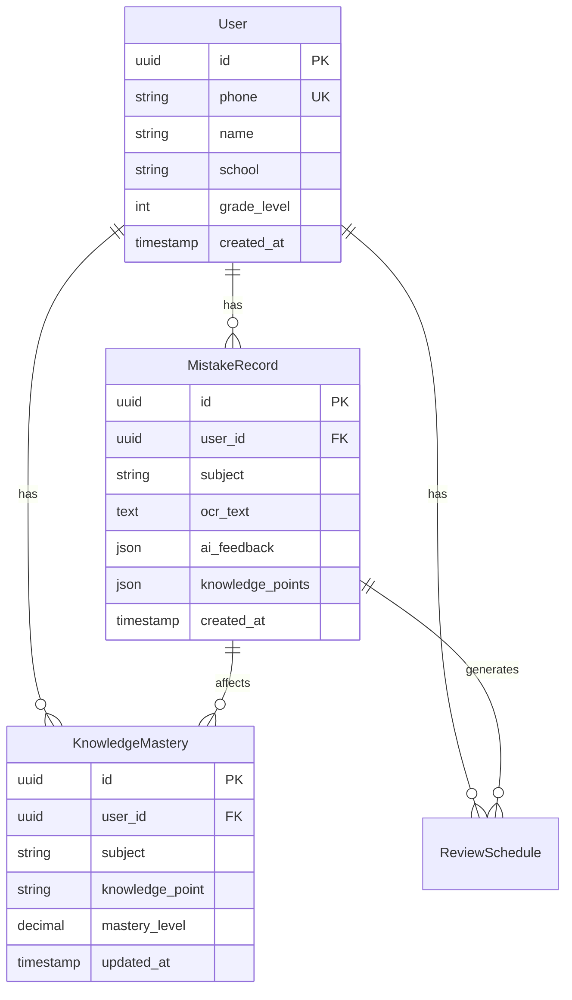

# 五好伴学（wuhao-tutor）开发指南

## 项目概述

**项目名称**: 五好伴学  
**英文名称**: wuhao-tutor  
**项目类型**: 基于AI的初高中学情管理系统  
**技术栈**: Python + FastAPI + PostgreSQL + Redis + Vue3 + 微信小程序

### 项目愿景
构建一个智能化的学情管理平台，通过AI技术帮助初高中学生：
- 🎯 **个性化学情分析** - 基于错题智能识别知识薄弱点
- 📊 **知识图谱构建** - 构建专属的学科知识网络
- 🔄 **智能复习推荐** - 基于艾宾浩斯记忆曲线的复习计划
- 🤖 **专属AI助教** - 基于学情数据的个性化AI交互

### 核心价值主张
- **每个学生专属数据库** - 确保数据隐私和个性化服务
- **多模态输入支持** - 文字、语音、图像三种交互方式
- **科学记忆曲线** - 基于艾宾浩斯理论的智能推送
- **知识图谱可视化** - 直观展示学习进度和知识掌握情况

---

## 技术架构

### 整体架构设计

```
┌─────────────────── 用户层 ──────────────────┐
│     Web端(Vue3)      │    微信小程序端        │
├─────────────────── 接口层 ──────────────────┤
│              FastAPI Gateway               │
├─────────────────── 服务层 ──────────────────┤
│  用户服务  │  学情服务  │  图谱服务  │  AI服务  │
├─────────────────── 数据层 ──────────────────┤
│ PostgreSQL │ Redis │ Vector DB │ Neo4j    │
├─────────────────── 外部服务 ────────────────┤
│ 阿里云智能体 │ 微信API │ OSS │ 短信服务     │
└─────────────────────────────────────────────┘
```

### 分层架构详解

#### 1. 表现层 (Presentation Layer)
- **Web端**: Vue3 + TypeScript + Vite
- **小程序端**: 微信小程序原生开发
- **职责**: 用户交互、页面展示、状态管理

#### 2. API层 (API Layer)
- **框架**: FastAPI + Pydantic
- **版本管理**: `/api/v1/` 路径前缀
- **职责**: 请求路由、参数验证、响应格式化

#### 3. 业务逻辑层 (Business Logic Layer)
- **服务模块**: 
  - 用户管理服务 (UserService)
  - 学情分析服务 (AnalyticsService)
  - 知识图谱服务 (GraphService)
  - AI集成服务 (AIService)
- **职责**: 核心业务逻辑、数据处理、外部服务调用

#### 4. 数据访问层 (Data Access Layer)
- **ORM**: SQLAlchemy 2.0+ (异步)
- **仓储模式**: Repository Pattern
- **职责**: 数据库操作、缓存管理、数据模型映射

#### 5. 数据存储层 (Data Storage Layer)
- **主数据库**: PostgreSQL (用户数据、业务数据)
- **图数据库**: Neo4j (知识图谱)
- **缓存层**: Redis (会话、临时数据)
- **向量数据库**: (后续接入，用于RAG)

---

## 项目结构

```
wuhao-tutor/
├── src/                        # 源代码目录
│   ├── api/                    # API路由层
│   │   ├── v1/                # v1版本API
│   │   │   ├── endpoints/     # 各模块端点
│   │   │   └── dependencies/  # API依赖注入
│   │   └── __init__.py
│   ├── core/                   # 核心配置和工具
│   │   ├── config.py          # 配置管理
│   │   ├── logging.py         # 日志配置
│   │   ├── security.py        # 安全相关
│   │   └── database.py        # 数据库配置
│   ├── models/                 # SQLAlchemy数据模型
│   │   ├── user.py            # 用户模型
│   │   ├── study.py           # 学习记录模型
│   │   └── knowledge.py       # 知识点模型
│   ├── schemas/                # Pydantic模型
│   │   ├── user.py            # 用户Schema
│   │   ├── study.py           # 学习Schema
│   │   └── common.py          # 通用Schema
│   ├── services/               # 业务逻辑层
│   │   ├── user_service.py    # 用户管理服务
│   │   ├── analytics_service.py # 学情分析服务
│   │   ├── graph_service.py   # 知识图谱服务
│   │   └── ai_service.py      # AI集成服务
│   ├── repositories/           # 数据访问层
│   │   ├── user_repository.py # 用户仓储
│   │   ├── study_repository.py # 学习仓储
│   │   └── base_repository.py # 基础仓储
│   └── main.py                 # 应用入口
├── tests/                      # 测试目录
│   ├── unit/                  # 单元测试
│   ├── integration/           # 集成测试
│   └── fixtures/              # 测试数据
├── scripts/                    # 自动化脚本
│   ├── init/                  # 初始化脚本
│   └── dev/                   # 开发工具脚本
├── docs/                       # 文档目录
│   ├── api/                   # API文档
│   └── architecture/          # 架构文档
├── alembic/                    # 数据库迁移
├── .env.example               # 环境配置模板
├── pyproject.toml             # 项目配置
└── Makefile                   # 自动化任务
```

---

## 开发环境搭建

### 环境要求
- **Python**: >= 3.11
- **Node.js**: >= 18.0 (前端开发)
- **PostgreSQL**: >= 14
- **Redis**: >= 6.0

### 1. 克隆项目
```bash
git clone <repository-url>
cd wuhao-tutor
```

### 2. Python环境配置
```bash
# 使用 uv 创建虚拟环境并安装依赖
uv sync

# 激活虚拟环境
source .venv/bin/activate  # macOS/Linux
# 或
.venv\Scripts\activate     # Windows
```

### 3. 环境配置
```bash
# 复制环境配置模板
cp .env.example .env

# 编辑配置文件，填入实际配置值
vim .env
```

### 4. 数据库初始化
```bash
# 启动PostgreSQL和Redis
brew services start postgresql
brew services start redis

# 创建数据库
createdb wuhao_tutor_dev

# 运行数据库迁移
make db-init
```

### 5. 启动开发服务器
```bash
# 启动后端服务
make dev-server

# 或直接使用Python
python -m uvicorn src.main:app --reload --host 0.0.0.0 --port 8000
```

### 6. 验证环境
访问 http://localhost:8000/docs 查看API文档

---

## 开发规范

### 代码规范

#### Python代码规范
- **格式化工具**: Black (line-length=88)
- **类型检查**: MyPy
- **代码检查**: Flake8
- **导入排序**: isort

```bash
# 代码格式化
make format

# 代码检查
make lint

# 类型检查
make type-check
```

#### 命名规范
- **变量/函数**: snake_case
- **类名**: PascalCase
- **常量**: UPPER_SNAKE_CASE
- **私有成员**: _leading_underscore
- **文件名**: snake_case.py

#### 文档规范
```python
def calculate_mastery_level(
    correct_count: int, 
    total_count: int, 
    difficulty_factor: float = 1.0
) -> float:
    """
    计算知识点掌握度
    
    Args:
        correct_count: 正确次数
        total_count: 总次数
        difficulty_factor: 难度系数
        
    Returns:
        掌握度分数 (0.0 - 1.0)
        
    Raises:
        ValueError: 当参数无效时
    """
    if total_count <= 0:
        raise ValueError("总次数必须大于0")
    return min((correct_count / total_count) * difficulty_factor, 1.0)
```

### API设计规范

#### RESTful API设计
```python
# 资源命名
GET    /api/v1/users                # 获取用户列表
POST   /api/v1/users                # 创建用户
GET    /api/v1/users/{user_id}      # 获取用户详情
PUT    /api/v1/users/{user_id}      # 更新用户
DELETE /api/v1/users/{user_id}      # 删除用户

# 嵌套资源
GET    /api/v1/users/{user_id}/mistakes    # 获取用户错题
POST   /api/v1/users/{user_id}/mistakes    # 创建错题记录
```

#### 响应格式标准
```json
// 成功响应
{
  "code": "SUCCESS",
  "message": "操作成功",
  "data": {
    // 具体数据
  }
}

// 错误响应
{
  "code": "VALIDATION_ERROR",
  "message": "参数验证失败",
  "details": [
    {
      "field": "email",
      "message": "邮箱格式不正确"
    }
  ]
}
```

### 提交规范

#### Git提交消息格式
```
<type>(<scope>): <description>

<body>

<footer>
```

#### 提交类型
- `feat`: 新功能
- `fix`: 修复bug
- `docs`: 文档更新
- `style`: 代码格式化
- `refactor`: 重构
- `test`: 测试相关
- `chore`: 构建过程或辅助工具的变动

#### 示例
```bash
feat(user): 添加用户注册功能

- 实现手机号注册
- 添加短信验证码验证
- 集成微信登录

Closes #123
```

---

## 测试策略

### 测试金字塔

```
        /\
       /  \
      /E2E \ <- 少量端到端测试
     /______\
    /        \
   /Integration\ <- 适量集成测试
  /______________\
 /                \
/    Unit Tests    \ <- 大量单元测试
/__________________\
```

### 测试类型

#### 1. 单元测试
```python
# tests/unit/test_user_service.py
import pytest
from src.services.user_service import UserService

@pytest.mark.asyncio
async def test_create_user_success():
    """测试用户创建成功"""
    service = UserService()
    user_data = {
        "phone": "13800138000",
        "name": "测试用户",
        "password": "test123456"
    }
    
    user = await service.create_user(user_data)
    assert user.phone == "13800138000"
    assert user.name == "测试用户"
```

#### 2. 集成测试
```python
# tests/integration/test_auth_api.py
import pytest
from httpx import AsyncClient

@pytest.mark.asyncio
async def test_user_registration_flow(client: AsyncClient):
    """测试用户注册流程"""
    # 发送验证码
    response = await client.post("/api/v1/auth/send-code", json={
        "phone": "13800138000"
    })
    assert response.status_code == 200
    
    # 注册用户
    response = await client.post("/api/v1/auth/register", json={
        "phone": "13800138000",
        "code": "123456",
        "name": "测试用户",
        "password": "test123456"
    })
    assert response.status_code == 201
```

### 测试配置
```bash
# 运行所有测试
make test

# 运行单元测试
make test-unit

# 运行集成测试
make test-integration

# 生成覆盖率报告
make test-coverage
```

---

## 数据库设计

### 主要实体关系



### 数据库迁移

```bash
# 创建迁移文件
alembic revision --autogenerate -m "描述变更内容"

# 应用迁移
alembic upgrade head

# 回滚迁移
alembic downgrade -1
```

---

## 部署方案

### 容器化部署

#### Docker配置
```dockerfile
# Dockerfile
FROM python:3.11-slim

WORKDIR /app

COPY pyproject.toml uv.lock ./
RUN pip install uv && uv sync --frozen

COPY . .

EXPOSE 8000
CMD ["python", "-m", "uvicorn", "src.main:app", "--host", "0.0.0.0", "--port", "8000"]
```

#### Docker Compose
```yaml
# docker-compose.yml
version: '3.8'
services:
  web:
    build: .
    ports:
      - "8000:8000"
    environment:
      - ENVIRONMENT=production
    depends_on:
      - postgres
      - redis
  
  postgres:
    image: postgres:15
    environment:
      POSTGRES_DB: wuhao_tutor
      POSTGRES_USER: postgres
      POSTGRES_PASSWORD: ${POSTGRES_PASSWORD}
    volumes:
      - postgres_data:/var/lib/postgresql/data
  
  redis:
    image: redis:7-alpine
    command: redis-server --appendonly yes
    volumes:
      - redis_data:/data

volumes:
  postgres_data:
  redis_data:
```

### CI/CD流程

```yaml
# .github/workflows/ci.yml
name: CI/CD Pipeline

on:
  push:
    branches: [ main, develop ]
  pull_request:
    branches: [ main ]

jobs:
  test:
    runs-on: ubuntu-latest
    steps:
    - uses: actions/checkout@v4
    - uses: actions/setup-python@v4
      with:
        python-version: '3.11'
    
    - name: Install dependencies
      run: |
        pip install uv
        uv sync
    
    - name: Run tests
      run: |
        make test-coverage
    
    - name: Upload coverage
      uses: codecov/codecov-action@v3
```

---

## 功能开发路线图

### 第一阶段：基础架构 (2-3周) ✅
- [x] 项目初始化和配置
- [x] FastAPI基础框架
- [x] 数据库模型设计
- [x] 用户认证系统
- [x] 测试框架搭建

### 第二阶段：核心功能 (3-4周)
- [ ] 图片上传和OCR集成
- [ ] 错题记录和管理
- [ ] 知识点提取和关联
- [ ] 学情分析基础功能
- [ ] Web端基础页面

### 第三阶段：智能化功能 (2-3周)
- [ ] 知识图谱构建
- [ ] 艾宾浩斯复习算法
- [ ] 学情报告生成
- [ ] AI问答集成
- [ ] 微信小程序开发

### 第四阶段：优化部署 (1-2周)
- [ ] 性能优化和压力测试
- [ ] 监控和日志完善
- [ ] 生产环境部署
- [ ] 用户体验优化

### 后续迭代
- [ ] 多学科扩展
- [ ] 社区化功能
- [ ] 数据分析面板
- [ ] 移动端APP

---

## 常见问题 FAQ

### Q: 如何添加新的API端点？
A: 
1. 在 `src/schemas/` 中定义请求/响应模型
2. 在 `src/services/` 中实现业务逻辑
3. 在 `src/api/v1/endpoints/` 中创建路由
4. 在 `src/api/v1/api.py` 中注册路由
5. 编写相应的测试用例

### Q: 如何进行数据库迁移？
A:
```bash
# 修改模型后生成迁移文件
alembic revision --autogenerate -m "add_new_column"

# 应用迁移
alembic upgrade head

# 回滚（如果需要）
alembic downgrade -1
```

### Q: 如何调试AI服务集成？
A:
1. 检查环境变量配置是否正确
2. 查看日志输出 `tail -f logs/app.log`
3. 使用PostMan测试API端点
4. 检查外部服务的配额和限制

### Q: 如何优化数据库查询性能？
A:
1. 使用 `explain` 分析查询计划
2. 添加适当的数据库索引
3. 使用连接池管理连接
4. 考虑使用Redis缓存热数据

---

## 联系方式

**项目维护者**: Liguo Ma  
**邮箱**: maliguo@outlook.com  
**项目地址**: [GitHub Repository]

---

*最后更新时间: 2025-09-25*