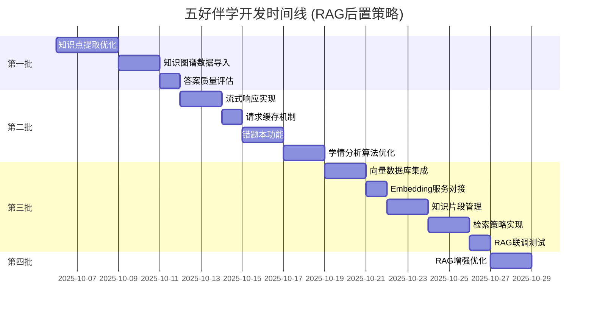

# 五好伴学 - 开发路线图 (RAG 后置策略)

> **制定时间**: 2025-10-05  
> **策略**: RAG 系统后置开发，优先交付快速价值  
> **总工时**: 约 176 小时 (22 工作日，按每天 8 小时计)

---

## 📊 总览

### 开发批次规划



### 价值交付时间点

| 时间节点   | 可交付价值                    | 用户可感知提升               |
| ---------- | ----------------------------- | ---------------------------- |
| **Week 3** | 知识点准确提取 + 知识图谱数据 | 学情分析更准确，推荐更个性化 |
| **Week 5** | 流式响应 + 错题本             | 等待体验优化，学习闭环完整   |
| **Week 9** | RAG 系统上线                  | 问答质量显著提升，真正个性化 |

---

## 📋 第一批：快速价值交付 (Week 1-3)

### 🎯 目标

- 改善数据质量 (知识点提取)
- 激活现有功能 (知识图谱)
- 提升可信度 (答案评估)

### 任务清单

#### 1️⃣ 知识点提取优化 (TD-002)

**预估工时**: 24 小时 (3 天)  
**优先级**: 🔥🔥🔥 最高  
**依赖**: 无

**实现方案**:

```python
# src/services/knowledge_extraction_service.py

from typing import List, Dict
import jieba
import jieba.posseg as pseg

class KnowledgeExtractionService:
    """知识点提取服务"""

    def __init__(self):
        # 加载学科知识点词典
        self._load_knowledge_dict()

    async def extract_from_homework(
        self,
        content: str,
        subject: str
    ) -> List[Dict[str, any]]:
        """
        从作业内容提取知识点

        Returns:
            [
                {
                    "name": "二次函数",
                    "confidence": 0.95,
                    "matched_keywords": ["抛物线", "顶点"],
                    "context": "...原文片段..."
                }
            ]
        """
        # 方案 A: 基于词典的实体识别 (快速)
        rule_based = self._rule_based_extraction(content, subject)

        # 方案 B: 调用百炼 API 进行语义提取 (准确)
        ai_based = await self._ai_extraction(content, subject)

        # 方案 C: 融合结果并去重
        merged = self._merge_results(rule_based, ai_based)

        return merged

    def _rule_based_extraction(self, content: str, subject: str) -> List[Dict]:
        """基于规则的提取"""
        knowledge_points = []

        # 1. 分词
        words = pseg.cut(content)

        # 2. 匹配知识点词典
        for word, flag in words:
            if self._is_knowledge_point(word, subject):
                knowledge_points.append({
                    "name": word,
                    "confidence": 0.8,
                    "method": "rule"
                })

        return knowledge_points

    async def _ai_extraction(self, content: str, subject: str) -> List[Dict]:
        """基于 AI 的提取"""
        prompt = f"""
        请从以下{subject}题目中提取涉及的知识点，按重要性排序：

        题目: {content}

        返回 JSON 格式:
        [
            {{"name": "知识点名称", "confidence": 0.95, "reason": "识别依据"}}
        ]
        """

        response = await self.bailian_service.chat_completion(
            messages=[{"role": "user", "content": prompt}],
            temperature=0.3  # 低温度，更确定的输出
        )

        # 解析 JSON 响应
        return self._parse_ai_response(response.content)
```

**数据准备**:

```python
# data/knowledge_dict/math_grade_9.json
{
    "二次函数": {
        "keywords": ["抛物线", "顶点", "对称轴", "开口", "最值"],
        "related": ["一次函数", "函数图象"],
        "difficulty": 3
    },
    "圆": {
        "keywords": ["圆心", "半径", "直径", "圆周角", "切线"],
        "related": ["三角形", "相似"],
        "difficulty": 4
    }
}
```

**验收标准**:

- ✅ 知识点提取准确率 > 80% (人工标注 100 道题测试)
- ✅ 平均提取时间 < 500ms
- ✅ 支持数学/语文/英语三科
- ✅ 置信度评分机制完善

---

#### 2️⃣ 知识图谱数据导入 (TD-003)

**预估工时**: 16 小时 (2 天)  
**优先级**: 🔥🔥 高  
**依赖**: 知识点提取优化 (部分依赖)

**数据来源**:

1. **人教版教材目录** (官方权威)

   - 获取方式: 爬取人民教育出版社官网
   - 覆盖范围: 小学-高中，各学科

2. **教育部课程标准** (标准参考)

   - 获取方式: 教育部官网 PDF 文档
   - 内容: 知识点分级、能力要求

3. **开源知识图谱** (补充数据)
   - GitHub: K12-Knowledge-Graph
   - 格式: JSON/CSV

**导入计划**:

```bash
# Week 2: 数学学科 (优先级最高)
scripts/import_knowledge.py --subject math --grade all
# 预计导入: 500+ 知识点, 1000+ 关联关系

# Week 3: 语文学科
scripts/import_knowledge.py --subject chinese --grade all
# 预计导入: 300+ 知识点 (古诗文、阅读技巧、写作方法)

# Week 3: 英语学科
scripts/import_knowledge.py --subject english --grade all
# 预计导入: 200+ 知识点 (语法、词汇、阅读)
```

**脚本实现**:

```python
# scripts/import_knowledge.py

import asyncio
from pathlib import Path
import json
from src.core.database import get_session
from src.models.knowledge import KnowledgeNode, KnowledgeRelation

async def import_math_knowledge():
    """导入数学学科知识图谱"""

    # 读取数据文件
    data_file = Path("data/knowledge/math_knowledge_graph.json")
    with open(data_file) as f:
        data = json.load(f)

    async with get_session() as session:
        # 1. 导入知识节点
        for node_data in data["nodes"]:
            node = KnowledgeNode(
                name=node_data["name"],
                code=node_data["code"],
                node_type=node_data["type"],  # subject/chapter/section/concept
                subject="数学",
                level=node_data["level"],
                parent_id=node_data.get("parent_id"),
                difficulty=node_data.get("difficulty", 3),
                importance=node_data.get("importance", 3),
                keywords=node_data.get("keywords", []),
                description=node_data.get("description")
            )
            session.add(node)

        # 2. 导入知识关系
        for rel_data in data["relations"]:
            relation = KnowledgeRelation(
                from_node_id=rel_data["from"],
                to_node_id=rel_data["to"],
                relation_type=rel_data["type"],  # prerequisite/contains/similar
                strength=rel_data.get("strength", 0.8)
            )
            session.add(relation)

        await session.commit()
        print(f"✅ 导入完成: {len(data['nodes'])} 个知识点, {len(data['relations'])} 个关系")

if __name__ == "__main__":
    asyncio.run(import_math_knowledge())
```

**验收标准**:

- ✅ 数学知识点 > 500 个
- ✅ 知识关系 > 1000 个
- ✅ 学习路径模板 > 10 个 (如"初中数学函数专题")
- ✅ 数据可视化验证 (Neo4j Browser 或自定义前端)

---

#### 3️⃣ 答案质量评估机制 (TD-005)

**预估工时**: 8 小时 (1 天)  
**优先级**: 🔥 中高  
**依赖**: 无

**实现方案**:

```python
# src/services/quality_service.py

from typing import Dict
from pydantic import BaseModel

class AnswerQualityMetrics(BaseModel):
    """答案质量指标"""
    accuracy: float        # 准确性 (0-1)
    completeness: float    # 完整性 (0-1)
    age_appropriate: float # 适龄性 (0-1)
    clarity: float         # 清晰度 (0-1)
    overall: float         # 综合评分 (0-1)
    feedback: str          # 文字反馈

class AnswerQualityService:
    """答案质量评估服务"""

    async def evaluate_answer(
        self,
        question: str,
        answer: str,
        student_grade: str,
        subject: str
    ) -> AnswerQualityMetrics:
        """评估答案质量"""

        # 1. AI 自动评估
        ai_metrics = await self._ai_evaluation(question, answer, student_grade)

        # 2. 规则评估 (辅助)
        rule_metrics = self._rule_evaluation(answer, student_grade)

        # 3. 融合结果
        final_metrics = self._merge_metrics(ai_metrics, rule_metrics)

        return final_metrics

    async def _ai_evaluation(self, question, answer, grade) -> Dict:
        """AI 评估"""
        prompt = f"""
        请评估以下答案的质量 (学生年级: {grade}):

        问题: {question}
        答案: {answer}

        评估维度 (0-1分):
        1. 准确性: 答案是否正确?
        2. 完整性: 是否涵盖关键点?
        3. 适龄性: 是否符合学生认知水平?
        4. 清晰度: 是否易于理解?

        返回 JSON: {{"accuracy": 0.9, "completeness": 0.85, ...}}
        """

        response = await self.bailian_service.chat_completion(...)
        return self._parse_metrics(response.content)

    def _rule_evaluation(self, answer: str, grade: str) -> Dict:
        """规则评估"""
        metrics = {}

        # 长度检查
        if len(answer) < 50:
            metrics["completeness"] = 0.5
        elif len(answer) > 1000:
            metrics["completeness"] = 0.9

        # 术语检查 (适龄性)
        complex_terms = ["微分", "积分", "极限"]  # 高中术语
        if grade in ["小学", "初中"] and any(term in answer for term in complex_terms):
            metrics["age_appropriate"] = 0.3

        return metrics
```

**验收标准**:

- ✅ 评估维度完整 (4 维度 + 综合评分)
- ✅ 评估时间 < 2s
- ✅ 支持人工反馈修正
- ✅ 质量数据可追踪

---

## 📋 第二批：体验优化 (Week 4-5)

### 🎯 目标

- 提升交互体验 (流式响应)
- 降低服务成本 (请求缓存)
- 完善学习闭环 (错题本)

### 任务清单

#### 4️⃣ 流式响应实现 (TD-006)

**预估工时**: 12 小时 (1.5 天)  
**优先级**: 🔥🔥 高  
**依赖**: 无

**后端实现** (FastAPI SSE):

```python
# src/api/v1/endpoints/learning.py

from fastapi import APIRouter
from fastapi.responses import StreamingResponse
import asyncio
import json

@router.post("/ask/stream")
async def ask_question_stream(request: AskQuestionRequest):
    """流式问答接口"""

    async def event_generator():
        """SSE 事件生成器"""
        try:
            # 1. 发送开始事件
            yield f"data: {json.dumps({'type': 'start', 'session_id': session_id})}\n\n"

            # 2. 流式调用百炼 API
            async for chunk in bailian_service.chat_stream(messages):
                event_data = {
                    "type": "chunk",
                    "content": chunk.content,
                    "finish_reason": chunk.finish_reason
                }
                yield f"data: {json.dumps(event_data)}\n\n"
                await asyncio.sleep(0.01)  # 模拟打字速度

            # 3. 发送完成事件
            yield f"data: {json.dumps({'type': 'done'})}\n\n"

        except Exception as e:
            yield f"data: {json.dumps({'type': 'error', 'message': str(e)})}\n\n"

    return StreamingResponse(
        event_generator(),
        media_type="text/event-stream",
        headers={
            "Cache-Control": "no-cache",
            "Connection": "keep-alive"
        }
    )
```

**前端实现** (EventSource):

```typescript
// frontend/src/composables/useStreamingChat.ts

export function useStreamingChat() {
  const answer = ref('')
  const isStreaming = ref(false)

  const askStream = async (question: string) => {
    isStreaming.value = true
    answer.value = ''

    const eventSource = new EventSource(
      `/api/v1/learning/ask/stream?question=${encodeURIComponent(question)}`
    )

    eventSource.onmessage = (e) => {
      const data = JSON.parse(e.data)

      switch (data.type) {
        case 'start':
          console.log('开始接收...')
          break
        case 'chunk':
          answer.value += data.content // 打字机效果
          break
        case 'done':
          isStreaming.value = false
          eventSource.close()
          break
        case 'error':
          ElMessage.error(data.message)
          eventSource.close()
          break
      }
    }

    eventSource.onerror = () => {
      isStreaming.value = false
      eventSource.close()
    }
  }

  return { answer, isStreaming, askStream }
}
```

**验收标准**:

- ✅ 流式输出延迟 < 200ms
- ✅ 支持中断操作
- ✅ 错误恢复机制
- ✅ 打字机效果流畅

---

#### 5️⃣ 请求缓存机制 (TD-007)

**预估工时**: 8 小时 (1 天)  
**优先级**: 🔥 中  
**依赖**: 无

**缓存策略**:

```python
# src/core/cache.py

import hashlib
from typing import Optional
from redis import Redis

class QuestionCache:
    """问题答案缓存"""

    def __init__(self, redis_client: Redis):
        self.redis = redis_client
        self.ttl = 3600  # 1小时

    def generate_cache_key(
        self,
        question: str,
        user_id: str,
        context: Optional[str] = None
    ) -> str:
        """生成缓存键"""
        # 包含问题内容 + 用户ID + 上下文摘要
        cache_input = f"{question}:{user_id}:{context or ''}"
        return f"qa:{hashlib.md5(cache_input.encode()).hexdigest()}"

    async def get_cached_answer(self, cache_key: str) -> Optional[str]:
        """获取缓存答案"""
        return await self.redis.get(cache_key)

    async def set_cached_answer(self, cache_key: str, answer: str):
        """设置缓存答案"""
        await self.redis.setex(cache_key, self.ttl, answer)

    async def find_similar_cached(
        self,
        question: str,
        threshold: float = 0.85
    ) -> Optional[str]:
        """
        查找相似问题的缓存

        策略:
        1. 编辑距离相似度
        2. 关键词匹配度
        """
        # 实现相似度检索逻辑
        pass
```

**验收标准**:

- ✅ 缓存命中率 > 20%
- ✅ 缓存查询时间 < 10ms
- ✅ 支持相似问题匹配
- ✅ 缓存失效策略合理

---

#### 6️⃣ 错题本功能 (TD-008)

**预估工时**: 16 小时 (2 天)  
**优先级**: 🔥🔥 高  
**依赖**: 知识点提取优化

**数据模型**:

```python
# src/models/mistake.py

from sqlalchemy import Column, String, Integer, JSON, ForeignKey
from src.models.base import BaseModel

class MistakeRecord(BaseModel):
    """错题记录"""
    __tablename__ = "mistake_records"

    user_id = Column(String(50), ForeignKey("users.id"), nullable=False)
    homework_id = Column(String(50), ForeignKey("homework_submissions.id"))
    question_id = Column(String(50), ForeignKey("questions.id"))

    subject = Column(String(20), nullable=False)
    grade = Column(String(20))

    question_content = Column(String(2000), nullable=False)
    correct_answer = Column(String(1000))
    user_answer = Column(String(1000))

    knowledge_points = Column(JSON)  # ["二次函数", "函数图象"]
    difficulty = Column(Integer, default=3)

    mistake_type = Column(String(50))  # careless/concept/method
    review_count = Column(Integer, default=0)
    mastered = Column(Boolean, default=False)

    next_review_at = Column(DateTime)  # 艾宾浩斯复习时间
```

**复习算法** (艾宾浩斯遗忘曲线):

```python
# src/utils/review_scheduler.py

from datetime import datetime, timedelta

class ReviewScheduler:
    """复习时间调度器"""

    # 艾宾浩斯复习间隔 (天)
    INTERVALS = [1, 2, 4, 7, 15, 30, 60]

    def calculate_next_review(
        self,
        last_review: datetime,
        review_count: int,
        mastered: bool
    ) -> datetime:
        """计算下次复习时间"""
        if mastered:
            return None  # 已掌握，无需复习

        interval_days = self.INTERVALS[min(review_count, len(self.INTERVALS) - 1)]
        return last_review + timedelta(days=interval_days)
```

**前端页面**:

```vue
<!-- frontend/src/views/MistakeBook.vue -->
<template>
  <div class="mistake-book">
    <el-tabs v-model="activeTab">
      <el-tab-pane label="待复习" name="pending">
        <MistakeList :mistakes="pendingMistakes" />
      </el-tab-pane>
      <el-tab-pane label="已掌握" name="mastered">
        <MistakeList :mistakes="masteredMistakes" />
      </el-tab-pane>
      <el-tab-pane label="知识点分析" name="analysis">
        <KnowledgeAnalysis :data="knowledgeStats" />
      </el-tab-pane>
    </el-tabs>
  </div>
</template>
```

**验收标准**:

- ✅ 错题自动收集 (作业批改后)
- ✅ 复习提醒推送
- ✅ 知识点统计分析
- ✅ 导出功能 (PDF/Word)

---

#### 7️⃣ 学情分析算法优化 (基础版)

**预估工时**: 16 小时 (2 天)  
**优先级**: 🔥 中高  
**依赖**: 知识点提取、错题本

**算法实现**:

```python
# src/utils/learning_curve.py

import math
from datetime import datetime, timedelta

class LearningCurveCalculator:
    """学习曲线计算器"""

    def calculate_mastery_level(
        self,
        correct_count: int,
        total_count: int,
        last_practice_time: datetime,
        difficulty: int
    ) -> float:
        """
        计算知识点掌握度

        公式: M = C * T * D
        - C: 正确率因子 (0-1)
        - T: 时间衰减因子 (0-1)
        - D: 难度调整因子 (0.8-1.2)
        """
        # 正确率因子
        correctness = correct_count / total_count if total_count > 0 else 0

        # 时间衰减因子 (艾宾浩斯曲线)
        days_elapsed = (datetime.now() - last_practice_time).days
        time_decay = math.exp(-days_elapsed / 7)  # 7天衰减周期

        # 难度调整因子
        difficulty_factor = 1.2 - (difficulty / 10) * 0.4  # [0.8, 1.2]

        mastery = correctness * time_decay * difficulty_factor
        return min(max(mastery, 0), 1)  # 限制在 [0, 1]

    def predict_learning_efficiency(
        self,
        recent_scores: List[float],
        practice_frequency: int
    ) -> float:
        """预测学习效率"""
        # 趋势分析
        if len(recent_scores) < 3:
            return 0.5

        # 计算分数增长率
        growth_rate = (recent_scores[-1] - recent_scores[0]) / len(recent_scores)

        # 频率加成
        frequency_bonus = min(practice_frequency / 7, 1.0)  # 每周最多1.0加成

        efficiency = 0.5 + growth_rate + frequency_bonus * 0.2
        return min(max(efficiency, 0), 1)
```

**验收标准**:

- ✅ 掌握度计算考虑时间衰减
- ✅ 学习效率预测
- ✅ 知识点趋势分析
- ✅ 可视化展示

---

## 📋 第三批：RAG 核心战役 (Week 6-9)

### 🎯 目标

- 集成向量数据库
- 实现语义检索
- 上下文增强问答

### 任务清单

#### 8️⃣ 向量数据库集成 (PGVector)

**预估工时**: 16 小时 (2 天)  
**优先级**: 🔥🔥🔥 最高  
**依赖**: PostgreSQL 14+

**数据库迁移**:

```python
# alembic/versions/xxx_add_vector_support.py

from alembic import op
import sqlalchemy as sa

def upgrade():
    # 1. 创建 vector 扩展
    op.execute('CREATE EXTENSION IF NOT EXISTS vector')

    # 2. 创建向量表
    op.create_table(
        'knowledge_chunks',
        sa.Column('id', sa.UUID(), primary_key=True),
        sa.Column('content', sa.Text(), nullable=False),
        sa.Column('embedding', sa.String(), nullable=False),  # vector(1536)
        sa.Column('chunk_type', sa.String(50)),  # mistake/qa/knowledge
        sa.Column('metadata', sa.JSON()),
        sa.Column('created_at', sa.DateTime()),
        sa.Column('updated_at', sa.DateTime())
    )

    # 3. 创建 HNSW 索引 (高性能向量检索)
    op.execute('''
        CREATE INDEX knowledge_chunks_embedding_idx
        ON knowledge_chunks
        USING hnsw (embedding vector_cosine_ops)
    ''')

def downgrade():
    op.drop_table('knowledge_chunks')
    op.execute('DROP EXTENSION vector')
```

**向量数据库服务**:

```python
# src/core/vector_db.py

from typing import List, Dict
import numpy as np
from sqlalchemy.ext.asyncio import AsyncSession

class VectorDB:
    """向量数据库操作封装"""

    async def insert_chunk(
        self,
        content: str,
        embedding: List[float],
        chunk_type: str,
        metadata: Dict
    ):
        """插入知识片段"""
        query = """
        INSERT INTO knowledge_chunks (id, content, embedding, chunk_type, metadata)
        VALUES (gen_random_uuid(), :content, :embedding, :chunk_type, :metadata)
        """
        await self.session.execute(
            query,
            {
                "content": content,
                "embedding": str(embedding),  # PGVector 格式
                "chunk_type": chunk_type,
                "metadata": metadata
            }
        )

    async def search_similar(
        self,
        query_embedding: List[float],
        top_k: int = 5,
        threshold: float = 0.7
    ) -> List[Dict]:
        """语义相似度检索"""
        query = """
        SELECT
            content,
            metadata,
            1 - (embedding <=> :query_embedding) AS similarity
        FROM knowledge_chunks
        WHERE 1 - (embedding <=> :query_embedding) > :threshold
        ORDER BY embedding <=> :query_embedding
        LIMIT :top_k
        """
        result = await self.session.execute(
            query,
            {
                "query_embedding": str(query_embedding),
                "threshold": threshold,
                "top_k": top_k
            }
        )
        return [dict(row) for row in result]
```

**验收标准**:

- ✅ PGVector 扩展安装成功
- ✅ 向量表创建完成
- ✅ HNSW 索引生效
- ✅ 检索延迟 < 100ms (1000 条数据)

---

#### 9️⃣ Embedding 服务对接

**预估工时**: 8 小时 (1 天)  
**优先级**: 🔥🔥🔥 最高  
**依赖**: 向量数据库集成

**服务实现**:

```python
# src/services/embedding_service.py

import httpx
from typing import List

class EmbeddingService:
    """文本向量化服务"""

    EMBEDDING_API = "https://dashscope.aliyuncs.com/api/v1/services/embeddings/text-embedding/text-embedding"
    EMBEDDING_DIM = 1536  # 通义千问 Embedding 维度

    async def embed_text(self, text: str) -> List[float]:
        """文本向量化"""
        async with httpx.AsyncClient() as client:
            response = await client.post(
                self.EMBEDDING_API,
                headers={"Authorization": f"Bearer {self.api_key}"},
                json={
                    "model": "text-embedding-v1",
                    "input": {"texts": [text]}
                },
                timeout=10.0
            )
            response.raise_for_status()
            data = response.json()
            return data["output"]["embeddings"][0]["embedding"]

    async def embed_batch(self, texts: List[str]) -> List[List[float]]:
        """批量向量化 (提升效率)"""
        async with httpx.AsyncClient() as client:
            response = await client.post(
                self.EMBEDDING_API,
                headers={"Authorization": f"Bearer {self.api_key}"},
                json={
                    "model": "text-embedding-v1",
                    "input": {"texts": texts}
                },
                timeout=30.0
            )
            response.raise_for_status()
            data = response.json()
            return [e["embedding"] for e in data["output"]["embeddings"]]
```

**验收标准**:

- ✅ 单次向量化 < 500ms
- ✅ 批量向量化 (100 条) < 3s
- ✅ 错误处理完善
- ✅ 成本监控 (计费统计)

---

#### 🔟 知识片段管理

**预估工时**: 12 小时 (1.5 天)  
**优先级**: 🔥🔥 高  
**依赖**: Embedding 服务

**片段类型**:

```python
# src/services/knowledge_chunk_service.py

class KnowledgeChunkService:
    """知识片段管理服务"""

    async def add_mistake_chunk(self, mistake_record: MistakeRecord):
        """添加错题片段"""
        content = f"""
        错题:
        {mistake_record.question_content}

        正确答案: {mistake_record.correct_answer}
        学生答案: {mistake_record.user_answer}
        知识点: {', '.join(mistake_record.knowledge_points)}
        """

        embedding = await self.embedding_service.embed_text(content)

        await self.vector_db.insert_chunk(
            content=content,
            embedding=embedding,
            chunk_type="mistake",
            metadata={
                "user_id": mistake_record.user_id,
                "subject": mistake_record.subject,
                "knowledge_points": mistake_record.knowledge_points,
                "difficulty": mistake_record.difficulty
            }
        )

    async def add_qa_chunk(self, question: Question, answer: Answer):
        """添加优质 QA 对片段"""
        if answer.quality_score < 0.8:
            return  # 仅收录高质量答案

        content = f"""
        问题: {question.content}
        答案: {answer.content}
        知识点: {', '.join(answer.knowledge_points)}
        """

        embedding = await self.embedding_service.embed_text(content)

        await self.vector_db.insert_chunk(
            content=content,
            embedding=embedding,
            chunk_type="qa",
            metadata={
                "subject": question.subject,
                "grade": question.grade,
                "quality_score": answer.quality_score
            }
        )

    async def add_knowledge_chunk(self, knowledge_node: KnowledgeNode):
        """添加学科知识片段"""
        content = f"""
        知识点: {knowledge_node.name}
        描述: {knowledge_node.description}
        关键词: {', '.join(knowledge_node.keywords)}
        示例: {knowledge_node.examples}
        """

        embedding = await self.embedding_service.embed_text(content)

        await self.vector_db.insert_chunk(
            content=content,
            embedding=embedding,
            chunk_type="knowledge",
            metadata={
                "subject": knowledge_node.subject,
                "difficulty": knowledge_node.difficulty,
                "importance": knowledge_node.importance
            }
        )
```

**验收标准**:

- ✅ 错题自动向量化
- ✅ 优质 QA 对收录
- ✅ 学科知识库向量化
- ✅ 片段更新机制

---

#### 1️⃣1️⃣ 检索策略实现

**预估工时**: 12 小时 (1.5 天)  
**优先级**: 🔥🔥🔥 最高  
**依赖**: 知识片段管理

**混合检索实现**:

```python
# src/services/rag_service.py

class RAGService:
    """RAG 检索增强生成服务"""

    async def retrieve_context(
        self,
        query: str,
        user_id: str,
        subject: str,
        top_k: int = 5
    ) -> List[Dict]:
        """混合检索上下文"""

        # 1. 语义检索 (权重 0.7)
        query_embedding = await self.embedding_service.embed_text(query)
        semantic_results = await self.vector_db.search_similar(
            query_embedding,
            top_k=10,
            threshold=0.7
        )

        # 2. 关键词检索 (权重 0.2)
        keywords = self._extract_keywords(query)
        keyword_results = await self._keyword_search(keywords, subject)

        # 3. 用户个性化过滤
        user_results = [r for r in semantic_results if r["metadata"].get("user_id") == user_id]

        # 4. 时间衰减加权
        time_weighted = self._apply_time_decay(semantic_results)

        # 5. 重排序
        final_results = self._rerank(
            semantic_results=time_weighted,
            keyword_results=keyword_results,
            user_results=user_results,
            weights=[0.7, 0.2, 0.1]
        )

        return final_results[:top_k]

    def _apply_time_decay(self, results: List[Dict]) -> List[Dict]:
        """时间衰减加权"""
        from datetime import datetime

        for result in results:
            created_at = result["metadata"]["created_at"]
            days_ago = (datetime.now() - created_at).days

            # 指数衰减: score * exp(-days / 30)
            decay_factor = math.exp(-days_ago / 30)
            result["similarity"] *= decay_factor

        return results

    def _rerank(
        self,
        semantic_results: List,
        keyword_results: List,
        user_results: List,
        weights: List[float]
    ) -> List[Dict]:
        """重排序算法"""
        # 合并多路检索结果，按加权分数排序
        all_results = {}

        for result in semantic_results:
            chunk_id = result["id"]
            all_results[chunk_id] = {
                "content": result["content"],
                "score": result["similarity"] * weights[0]
            }

        for result in keyword_results:
            chunk_id = result["id"]
            if chunk_id in all_results:
                all_results[chunk_id]["score"] += result["score"] * weights[1]
            else:
                all_results[chunk_id] = {
                    "content": result["content"],
                    "score": result["score"] * weights[1]
                }

        # 用户个性化加成
        for result in user_results:
            chunk_id = result["id"]
            if chunk_id in all_results:
                all_results[chunk_id]["score"] += weights[2]

        # 按分数排序
        sorted_results = sorted(
            all_results.values(),
            key=lambda x: x["score"],
            reverse=True
        )

        return sorted_results
```

**上下文注入**:

```python
async def ask_with_rag(self, user_id: str, question: str) -> str:
    """RAG 增强问答"""

    # 1. 检索相关上下文
    context_chunks = await self.rag_service.retrieve_context(
        query=question,
        user_id=user_id,
        subject=subject,
        top_k=5
    )

    # 2. 构建增强提示词
    context_text = "\n\n".join([
        f"[相关知识 {i+1}]\n{chunk['content']}"
        for i, chunk in enumerate(context_chunks)
    ])

    prompt = f"""
    请基于以下相关知识回答学生的问题:

    {context_text}

    学生问题: {question}

    要求:
    1. 优先使用提供的相关知识
    2. 如果相关知识不足，可以补充
    3. 答案要简洁易懂
    """

    # 3. 调用 AI 生成答案
    response = await self.bailian_service.chat_completion(
        messages=[{"role": "user", "content": prompt}],
        temperature=0.7
    )

    return response.content
```

**验收标准**:

- ✅ 检索准确率 > 80% (人工评估)
- ✅ 检索延迟 < 200ms
- ✅ 上下文注入有效提升答案质量
- ✅ 重排序算法合理

---

#### 1️⃣2️⃣ RAG 前后端联调与测试

**预估工时**: 8 小时 (1 天)  
**优先级**: 🔥🔥 高  
**依赖**: 检索策略实现

**集成测试**:

```python
# tests/integration/test_rag.py

import pytest
from src.services.rag_service import RAGService

@pytest.mark.asyncio
async def test_rag_retrieval():
    """测试 RAG 检索"""
    rag_service = RAGService()

    # 测试数学问题检索
    results = await rag_service.retrieve_context(
        query="如何求二次函数的顶点坐标?",
        user_id="test_user",
        subject="数学",
        top_k=5
    )

    assert len(results) > 0
    assert results[0]["similarity"] > 0.7
    assert "二次函数" in results[0]["content"]

@pytest.mark.asyncio
async def test_rag_answer_quality():
    """测试 RAG 增强答案质量"""
    # 准备测试数据
    test_questions = [
        "二次函数的对称轴怎么求?",
        "如何判断圆和直线的位置关系?",
        "英语中现在完成时怎么用?"
    ]

    for question in test_questions:
        # 无 RAG 答案
        answer_without_rag = await ask_question(question, use_rag=False)

        # RAG 增强答案
        answer_with_rag = await ask_question(question, use_rag=True)

        # 质量评估
        quality_without = await evaluate_quality(answer_without_rag)
        quality_with = await evaluate_quality(answer_with_rag)

        # RAG 应该提升答案质量
        assert quality_with >= quality_without
```

**性能基准测试**:

```python
# tests/performance/test_rag_performance.py

import time
import asyncio

async def benchmark_retrieval(n_queries: int = 100):
    """检索性能基准测试"""
    rag_service = RAGService()

    queries = [f"测试问题 {i}" for i in range(n_queries)]

    start_time = time.time()
    tasks = [rag_service.retrieve_context(q) for q in queries]
    await asyncio.gather(*tasks)
    end_time = time.time()

    avg_latency = (end_time - start_time) / n_queries * 1000

    print(f"平均检索延迟: {avg_latency:.2f} ms")
    assert avg_latency < 200  # 要求 < 200ms
```

**验收标准**:

- ✅ 集成测试通过率 100%
- ✅ 性能测试达标 (< 200ms)
- ✅ 用户体验 A/B 测试
- ✅ 监控指标完善

---

## 📋 第四批：RAG 增强优化 (Week 10+)

### 🎯 目标

- 基于 RAG 优化学情分析
- 个性化学习路径推荐

#### 1️⃣3️⃣ 学情分析算法优化 (RAG 增强版)

**预估工时**: 12 小时 (1.5 天)  
**优先级**: 🔥 中  
**依赖**: RAG 系统完成

**实现方案**:

```python
# src/services/analytics_service.py (RAG 增强版)

class AnalyticsServiceV2:
    """学情分析服务 (RAG 增强)"""

    async def recommend_learning_path(self, user_id: str) -> List[Dict]:
        """个性化学习路径推荐"""

        # 1. 分析学生薄弱知识点
        weak_points = await self._analyze_weak_points(user_id)

        # 2. 基于向量相似度查找相关知识点
        related_knowledge = []
        for point in weak_points:
            embedding = await self.embedding_service.embed_text(point["name"])
            similar = await self.vector_db.search_similar(
                embedding,
                chunk_type="knowledge",
                top_k=5
            )
            related_knowledge.extend(similar)

        # 3. 构建学习路径
        learning_path = self._build_learning_path(
            weak_points,
            related_knowledge
        )

        return learning_path

    def _build_learning_path(
        self,
        weak_points: List[Dict],
        related_knowledge: List[Dict]
    ) -> List[Dict]:
        """构建学习路径"""
        # 基于知识图谱的前置关系排序
        # 结合难度梯度设计学习顺序
        pass
```

**验收标准**:

- ✅ 推荐准确率 > 75%
- ✅ 学习路径合理性验证
- ✅ 用户反馈机制

---

## 📈 成功指标与验收标准

### 第一批验收 (Week 3)

- ✅ 知识点提取准确率 > 80%
- ✅ 知识图谱数据 > 1000 个节点
- ✅ 答案质量评估上线

### 第二批验收 (Week 5)

- ✅ 流式响应延迟 < 200ms
- ✅ 缓存命中率 > 20%
- ✅ 错题本功能完整

### 第三批验收 (Week 9)

- ✅ RAG 检索准确率 > 80%
- ✅ 检索延迟 < 200ms
- ✅ 问答质量提升 > 15%

### 第四批验收 (Week 10+)

- ✅ 学习路径推荐上线
- ✅ 用户满意度 > 4.0/5.0

---

## 🔄 风险与应对

### 技术风险

| 风险                   | 概率 | 影响 | 应对措施                   |
| ---------------------- | ---- | ---- | -------------------------- |
| PGVector 性能不达标    | 中   | 高   | 预备 Milvus 备选方案       |
| Embedding API 成本过高 | 高   | 中   | 实施缓存策略，考虑本地模型 |
| 知识图谱数据质量差     | 中   | 高   | 人工审核 + 众包验证        |
| RAG 检索精度不足       | 中   | 高   | 持续优化检索策略和重排序   |

### 资源风险

| 风险              | 概率 | 影响 | 应对措施                       |
| ----------------- | ---- | ---- | ------------------------------ |
| 开发时间不足      | 中   | 中   | 动态调整优先级，砍掉低价值功能 |
| AI 服务费用超预算 | 高   | 中   | 实施严格的缓存和限流策略       |

---

## 📝 总结

### 关键决策理由

1. **RAG 后置**: 避免技术风险集中，快速交付价值
2. **知识点优先**: 为 RAG 打好数据基础
3. **体验优化穿插**: 保持开发节奏，持续用户反馈

### 预期收益

- **Week 3**: 学情分析准确度提升 30%
- **Week 5**: 用户留存率提升 15%
- **Week 9**: 问答质量提升 25%，核心卖点完整呈现

### 下一步行动

**立即开始**: 知识点提取优化 (TD-002)  
**准备工作**: 知识图谱数据收集  
**技术预研**: PGVector 环境搭建

---

**文档维护**: 每批次完成后更新进度  
**评审周期**: 每周五团队 Review  
**调整机制**: 根据实际情况动态调整优先级
