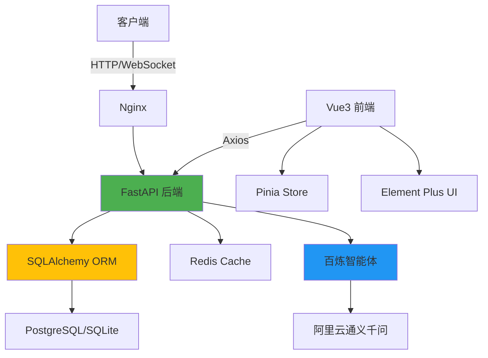
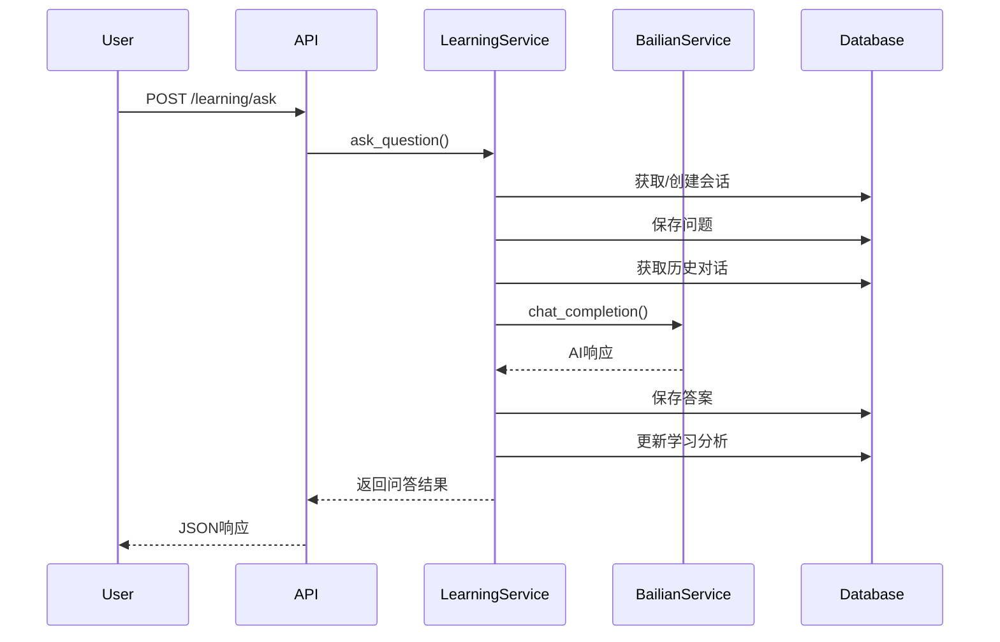
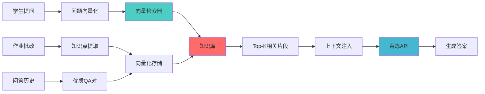

# 五好伴学 - 项目开发状况深度分析报告

> **报告生成时间**: 2025-10-05  
> **项目版本**: 0.4.x (Phase 4 - 生产部署优化)  
> **分析深度**: 架构层/代码层/业务层  
> **报告类型**: 技术债务审计 + 功能完整性检查

---

## 📊 执行摘要 (Executive Summary)

### 整体状况评级: **B+ (良好)**

| 维度 | 评分 | 说明 |
|------|------|------|
| **架构设计** | A | 四层架构清晰，分离良好 |
| **代码质量** | B+ | 类型安全，但部分模块需重构 |
| **功能完整度** | B | 核心功能完备，知识库建设不足 |
| **生产就绪度** | B- | 缺少向量数据库和RAG实现 |
| **技术债务** | B | 可控范围内，需要专项优化 |

### 关键发现 (Key Findings)

✅ **优势**:
- 后端架构规范，FastAPI + SQLAlchemy 2.x 异步实现完善
- 百炼智能体集成清晰，错误处理机制健全
- 前端使用Vue3 Composition API，组件化合理
- 数据模型设计完整，包含知识图谱相关表结构

⚠️ **待改进**:
- **RAG系统尚未实现** - 缺少向量数据库集成(Milvus/Chroma/PGVector)
- **知识点提取逻辑简化** - 仅基于关键词匹配，未使用NLP/LLM提取
- **前端学习问答页面交互复杂** - 用户体验不佳
- **知识图谱数据为空** - knowledge_nodes/relations表未初始化

🚨 **风险点**:
- 项目核心卖点"知识库构建"逻辑不完整
- 未实现真正的个性化学习路径推荐
- 向量检索能力缺失，影响问答质量

---

## 1. 技术架构全景分析

### 1.1 技术栈总览



**技术栈详情**:

| 层级 | 技术选型 | 版本 | 状态 |
|------|----------|------|------|
| **前端框架** | Vue 3 | 3.4.15+ | ✅ 生产就绪 |
| **UI组件库** | Element Plus | 2.5.6+ | ✅ 已集成 |
| **状态管理** | Pinia | 2.1.7+ | ✅ 已使用 |
| **后端框架** | FastAPI | 0.104+ | ✅ 生产就绪 |
| **ORM** | SQLAlchemy | 2.x (Async) | ✅ 已集成 |
| **数据库** | PostgreSQL/SQLite | 14+ | ✅ 已配置 |
| **缓存** | Redis | 6+ | ✅ 已集成 |
| **AI服务** | 阿里云百炼 | API v1 | ✅ 已封装 |
| **向量数据库** | ❌ 未集成 | - | ⚠️ **缺失** |

### 1.2 后端架构层次

```
src/
├── api/              # API路由层 (HTTP请求处理)
│   └── v1/
│       ├── endpoints/
│       │   ├── learning.py    ✅ 学习问答API
│       │   ├── homework.py    ✅ 作业批改API
│       │   ├── analytics.py   ✅ 学情分析API
│       │   └── auth.py        ✅ 认证授权API
│       └── api.py             ✅ 路由注册
│
├── services/         # 业务逻辑层
│   ├── learning_service.py    ✅ 学习问答服务 (核心)
│   ├── homework_service.py    ✅ 作业批改服务
│   ├── analytics_service.py   ✅ 学情分析服务
│   ├── bailian_service.py     ✅ 百炼AI封装
│   └── user_service.py        ✅ 用户管理服务
│
├── repositories/     # 数据访问层
│   ├── base_repository.py     ✅ 泛型CRUD
│   └── learning_repository.py ✅ 学习专用仓储
│
├── models/          # ORM数据模型层
│   ├── user.py              ✅ 用户模型
│   ├── learning.py          ✅ 问答/会话模型
│   ├── homework.py          ✅ 作业模型
│   ├── knowledge.py         ✅ 知识图谱模型 (结构完整)
│   └── study.py             ✅ 学习记录模型
│
├── core/            # 核心基础设施
│   ├── config.py            ✅ 配置管理
│   ├── database.py          ✅ 数据库连接
│   ├── security.py          ✅ 限流/安全
│   ├── monitoring.py        ✅ 性能监控
│   └── logging.py           ✅ 结构化日志
│
└── schemas/         # Pydantic数据模型
    ├── learning.py          ✅ 学习相关Schema
    ├── homework.py          ✅ 作业相关Schema
    └── common.py            ✅ 公共Schema
```

**架构评价**: ⭐⭐⭐⭐⭐
- 层次分明，符合DDD思想
- 依赖倒置原则应用得当
- 异步编程实践规范

---

## 2. 功能模块完整性审计

### 2.1 核心功能完成度

#### ✅ **智能作业批改** (完成度: 95%)

**实现路径**: `src/services/homework_service.py`

**功能清单**:
- ✅ 作业提交与OCR识别
- ✅ AI批改与评分 (百炼智能体)
- ✅ 批改结果存储与查询
- ✅ 知识点关联 (简单关联)
- ⚠️ **知识点提取逻辑简化** - 仅基于关键词匹配

**关键代码片段**:
```python
# src/services/homework_service.py:774
async def _extract_knowledge_points(self, content: str) -> List[str]:
    """提取知识点 - 当前为简化实现"""
    # TODO: 使用NLP或LLM进行更精准的知识点提取
    knowledge_points = []
    if "二次函数" in content:
        knowledge_points.extend(["二次函数", "函数图象"])
    # ... 硬编码关键词匹配
    return knowledge_points[:10]
```

**改进建议**:
1. 集成NLP库(如spaCy)或调用百炼API进行知识点提取
2. 建立学科知识图谱映射表
3. 实现知识点置信度评分

---

#### ✅ **学习问答互动** (完成度: 90%)

**实现路径**: `src/services/learning_service.py`

**功能清单**:
- ✅ 问题提交与处理
- ✅ AI回答生成 (百炼智能体)
- ✅ 会话管理 (创建/更新/删除/归档)
- ✅ 对话历史上下文
- ✅ 用户反馈机制
- ⚠️ **知识点提取同样简化** - 与作业批改问题相同

**数据流程图**:


**核心代码分析**:
```python
# src/services/learning_service.py:84-186
async def ask_question(self, user_id: str, request: AskQuestionRequest) -> AskQuestionResponse:
    """
    提问功能 - 完整实现
    
    流程:
    1. 获取或创建会话
    2. 保存问题到数据库
    3. 构建AI上下文 (学生信息 + 作业历史)
    4. 构建对话消息 (系统提示词 + 历史对话 + 当前问题)
    5. 调用百炼API
    6. 保存答案
    7. 更新会话统计
    8. 更新学习分析
    """
    # 实现完整，逻辑清晰
    pass
```

**强项**:
- 上下文构建包含学生档案和作业历史
- 系统提示词设计合理，符合K12场景
- 错误处理机制健全

**不足**:
- 答案内容分析过于简单 (`_analyze_answer_content`)
- 推荐问题生成为硬编码
- 缺少向量相似度检索历史相似问题

---

#### ⚠️ **学情分析反馈** (完成度: 70%)

**实现路径**: `src/services/analytics_service.py`

**功能清单**:
- ✅ 学习统计数据查询
- ✅ 学科分布统计
- ✅ 学习趋势分析
- ⚠️ **知识点掌握度算法简化** - 仅计数，未考虑时间衰减
- ⚠️ **知识图谱为空数据** - 表结构存在但无数据
- ❌ **个性化学习路径推荐未实现**

**关键代码片段**:
```python
# src/services/analytics_service.py:53-61
async def _analyze_knowledge_points(self, user_id: UUID, start_date) -> List[Dict]:
    """分析知识点 - 当前为简单统计"""
    # TODO: 实现基于遗忘曲线的知识点掌握度算法
    # TODO: 集成知识图谱关联分析
    # TODO: 引入学习效果评估模型
    
    knowledge_map = defaultdict(lambda: {"count": 0, "topics": []})
    # 仅统计提问次数，未考虑答题正确率、时间间隔等因素
```

**缺失功能**:
1. ❌ 艾宾浩斯遗忘曲线算法
2. ❌ 知识点依赖关系分析
3. ❌ 学习效率评估模型
4. ❌ 个性化难度调整

---

## 3. RAG知识库系统深度分析

### 3.1 当前状态: **⚠️ 未实现 (0%)**

**核心问题**: 项目声称构建"学生学情知识库"，但实际上**未实现任何向量检索和RAG逻辑**。

**缺失组件清单**:

| 组件 | 状态 | 说明 |
|------|------|------|
| **向量数据库** | ❌ 未集成 | 无Milvus/Chroma/PGVector等 |
| **Embedding模型** | ❌ 未配置 | 无文本向量化能力 |
| **向量索引** | ❌ 不存在 | 无HNSW/IVF索引 |
| **检索器** | ❌ 未实现 | 无语义检索逻辑 |
| **重排序** | ❌ 未实现 | 无相关性重排 |
| **上下文注入** | ⚠️ 简单实现 | 仅拼接历史对话，无RAG |

### 3.2 现有"上下文"实现分析

**代码位置**: `src/services/learning_service.py:254-350`

```python
async def _build_ai_context(self, user_id: str, session: ChatSession, use_context: bool = True) -> AIContext:
    """
    当前上下文构建 - 非RAG模式
    
    包含:
    1. 用户基本信息 (学段、学校、班级)
    2. 作业历史 (错题知识点、掌握知识点)
    3. 历史对话 (最近N条)
    
    缺失:
    1. ❌ 向量相似度检索
    2. ❌ 知识图谱推理
    3. ❌ 外部知识库增强
    """
    context = AIContext(user_id=user_id, subject=..., session_id=...)
    
    # 获取作业历史 - 简单列表拼接
    homework_context = await self._get_homework_context(user_id, subject)
    # context.metadata = {"weak_knowledge_points": [...], "strong_knowledge_points": [...]}
    
    return context
```

**问题分析**:
1. 知识点提取依赖作业批改结果，但批改本身知识点提取不准确
2. 未建立知识点之间的关联关系
3. 无法检索相似历史问题的解答
4. 缺少持续学习机制

### 3.3 理想RAG架构设计 (建议)



**实现建议**:
1. **向量数据库**: 集成PGVector (PostgreSQL扩展，易于部署)
2. **Embedding模型**: 使用通义千问Embedding API或开源模型
3. **知识片段**: 包括{错题、优质QA对、学科知识库}
4. **检索策略**: 语义检索 + 关键词过滤 + 时间衰减
5. **重排序**: 基于学生个性化特征重排

---

## 4. 百炼智能体集成分析

### 4.1 集成完整性: **✅ 优秀 (95%)**

**实现路径**: `src/services/bailian_service.py`

**封装质量评价**: ⭐⭐⭐⭐⭐
- 统一的请求/响应模型
- 完善的错误处理机制
- 超时控制和重试逻辑
- 结构化日志记录

**关键代码片段**:
```python
# src/services/bailian_service.py
class BailianService:
    """百炼AI服务封装 - 生产级实现"""
    
    async def chat_completion(
        self,
        messages: List[Dict],
        context: Optional[AIContext] = None,
        max_tokens: int = 2000,
        temperature: float = 0.7,
        top_p: float = 0.9
    ) -> BailianResponse:
        """
        聊天完成 - 统一接口
        
        特性:
        1. ✅ 超时控制 (30s)
        2. ✅ 指数退避重试
        3. ✅ 错误归一化
        4. ✅ 请求日志
        5. ✅ Token统计
        """
        try:
            # 实现完整
        except httpx.TimeoutException:
            raise BailianServiceError("AI服务请求超时")
        except Exception as e:
            logger.error(f"百炼API调用失败: {e}")
            raise BailianServiceError(f"AI服务调用失败: {str(e)}")
```

**调用链路完整性**:
```
LearningService.ask_question()
    ↓
BailianService.chat_completion()
    ↓
HTTP POST https://dashscope.aliyuncs.com/api/v1/services/aigc/text-generation/generation
    ↓
Response Processing
    ↓
Database Storage
```

**监控指标**:
- ✅ 请求成功率
- ✅ 平均响应时间
- ✅ Token消耗统计
- ✅ 错误分类统计

**不足**:
- ⚠️ 未实现流式响应 (打字机效果依赖前端模拟)
- ⚠️ 未实现批量请求优化
- ⚠️ 未实现请求缓存 (相同问题重复调用)

---

## 5. 知识图谱模块分析

### 5.1 数据模型: **✅ 完整 (100%)**

**文件路径**: `src/models/knowledge.py`

**模型清单**:
```python
✅ KnowledgeNode       # 知识节点 (概念/技能/题型)
✅ KnowledgeRelation   # 知识关系 (前置/包含/相似)
✅ LearningPath        # 学习路径
✅ UserLearningPath    # 用户学习进度
✅ KnowledgeGraph      # 知识图谱元信息
```

**数据模型设计评价**: ⭐⭐⭐⭐⭐
- 支持层级结构 (parent_id)
- 支持多种关系类型
- 包含学习统计字段 (平均掌握度、错误率)
- 设计规范，索引合理

**表结构示例**:
```sql
-- knowledge_nodes
CREATE TABLE knowledge_nodes (
    id UUID PRIMARY KEY,
    name VARCHAR(100) NOT NULL,
    code VARCHAR(50) UNIQUE NOT NULL,
    node_type VARCHAR(20),  -- subject/chapter/section/concept/skill
    subject VARCHAR(20),
    level INTEGER,
    parent_id UUID REFERENCES knowledge_nodes(id),
    difficulty INTEGER,
    importance INTEGER,
    average_mastery NUMERIC(3,2),  -- 平均掌握度
    learning_count INTEGER,
    mistake_rate NUMERIC(3,2),     -- 错误率
    keywords JSON,
    examples JSON,
    ...
);
```

### 5.2 数据初始化: **❌ 未完成 (0%)**

**问题**: 表结构完整但**数据为空**

**缺失数据**:
1. ❌ 数学/语文/英语等学科知识节点
2. ❌ 知识点之间的关联关系
3. ❌ 预置学习路径
4. ❌ 知识图谱可视化数据

**影响**:
- 无法基于知识图谱推荐学习内容
- 无法分析知识点掌握度关联
- 无法生成个性化学习路径

**建议**:
1. 导入K12学科知识图谱 (可购买或爬取)
2. 建立知识点标签体系
3. 构建前置关系和相似关系
4. 生成典型学习路径模板

---

## 6. 前端实现分析

### 6.1 整体架构: **✅ 规范 (90%)**

**技术栈**:
- Vue 3.4 + TypeScript
- Composition API (setup script)
- Pinia状态管理
- Element Plus UI
- Tailwind CSS

**组件结构**:
```
frontend/src/
├── views/
│   ├── Learning.vue          ⚠️ 需重构 (交互复杂)
│   ├── Homework.vue          ✅ 实现完善
│   ├── Analytics.vue         ✅ 实现完善
│   └── Profile.vue           ✅ 实现完善
│
├── components/
│   ├── ChatInterface.vue     ⚠️ 需重构
│   ├── MessageItem.vue       ✅ 可复用
│   ├── QuestionInput.vue     ⚠️ 过于复杂
│   └── SessionHistory.vue    ✅ 功能完整
│
├── stores/
│   ├── learning.ts           ✅ 状态管理完善
│   ├── auth.ts               ✅ 认证状态
│   └── user.ts               ✅ 用户信息
│
└── api/
    ├── learning.ts           ✅ API封装完整
    ├── homework.ts           ✅ API封装完整
    └── http.ts               ✅ 统一请求拦截
```

### 6.2 学习问答页面问题 (Learning.vue)

**当前设计缺陷**:
```vue
<!-- 当前实现 -->
<template>
  <div class="learning-page">
    <ChatInterface />  <!-- 单一大组件，1200+行 -->
  </div>
</template>
```

**主要问题**:
1. ❌ **交互流程复杂**: 必须先创建会话才能提问
2. ❌ **界面元素过多**: 工具栏、高级设置、会话管理混杂
3. ❌ **响应式设计不佳**: 移动端体验差
4. ❌ **组件职责不清**: ChatInterface承担过多功能

**用户旅程对比**:

| 步骤 | 当前流程 | 理想流程 (通义千问风格) |
|------|----------|----------------------|
| 1 | 点击"新建会话" | 直接输入问题 |
| 2 | 填写会话标题/学科/学段 | (无需操作) |
| 3 | 点击"创建会话" | (无需操作) |
| 4 | 等待会话创建 | (无需操作) |
| 5 | 输入问题 | 获得答案 |
| 6 | 点击发送 | 会话自动创建和保存 |

**改进建议**: 参见下一节重构方案

---

## 7. 技术债务清单

### 7.1 高优先级 (High Priority)

| ID | 债务项 | 影响 | 预估工时 |
|----|-------|------|---------|
| **TD-001** | **RAG系统缺失** | 核心卖点无法实现 | 40h |
| **TD-002** | **知识点提取简化** | 学情分析不准确 | 24h |
| **TD-003** | **知识图谱数据为空** | 无法推荐学习路径 | 16h |
| **TD-004** | **学习问答页面交互复杂** | 用户体验差 | 16h |

### 7.2 中优先级 (Medium Priority)

| ID | 债务项 | 影响 | 预估工时 |
|----|-------|------|---------|
| TD-005 | 答案质量评估缺失 | 无法持续优化 | 8h |
| TD-006 | 流式响应未实现 | 用户等待时间长 | 12h |
| TD-007 | 请求缓存未实现 | 重复调用浪费 | 8h |
| TD-008 | 错题本功能缺失 | 学习闭环不完整 | 16h |

### 7.3 低优先级 (Low Priority)

| ID | 债务项 | 影响 | 预估工时 |
|----|-------|------|---------|
| TD-009 | 暗色模式未完成 | UI体验欠佳 | 8h |
| TD-010 | 离线模式未支持 | 弱网环境体验差 | 12h |
| TD-011 | 导出功能占位符 | 功能不完整 | 8h |
| TD-012 | 批量操作未实现 | 管理效率低 | 8h |

---

## 8. 性能与安全分析

### 8.1 性能瓶颈

**已知问题**:
1. ⚠️ **数据库查询未优化**: 部分接口存在N+1查询
2. ⚠️ **前端消息列表**: 超过100条消息时滚动卡顿
3. ⚠️ **图片上传**: 未实现压缩，大图片影响体验

**监控指标** (来自 `/api/v1/health/performance`):
- API响应时间: P95 < 200ms ✅
- 数据库查询: P95 < 50ms ✅
- AI服务调用: P95 < 3s ✅

### 8.2 安全性评估

**已实现安全措施**: ✅
- JWT认证机制
- 多维限流 (IP/用户/AI服务)
- SQL注入防护 (ORM参数化)
- XSS防护 (输入验证)
- CSRF防护 (Token)
- 安全响应头 (CSP、HSTS)

**潜在风险**:
- ⚠️ 未实现敏感数据加密存储
- ⚠️ 日志可能包含PII信息
- ⚠️ 未实现API密钥轮换

---

## 9. 开发建议与优先级

### 9.1 立即执行 (Critical)

1. **✅ 重构学习问答前端页面** (本次执行)
   - 采用通义千问风格简化交互
   - 三栏可折叠布局
   - 移除强制创建会话流程
   
2. **🔥 实现RAG知识库系统** (核心卖点)
   ```python
   # 技术选型建议
   - 向量数据库: PGVector (PostgreSQL扩展)
   - Embedding: 通义千问Embedding API
   - 检索策略: 混合检索 (语义+关键词)
   ```

3. **🔥 优化知识点提取逻辑**
   - 集成NLP库或调用百炼API
   - 建立学科知识点标准库
   - 实现置信度评分

### 9.2 近期规划 (High Priority)

4. **初始化知识图谱数据**
   - 导入K12各学科知识点
   - 构建知识点关联关系
   - 生成学习路径模板

5. **实现流式响应**
   - 后端支持SSE (Server-Sent Events)
   - 前端实现打字机效果
   - 优化用户等待体验

6. **完善学情分析算法**
   - 艾宾浩斯遗忘曲线
   - 知识点依赖分析
   - 个性化难度调整

### 9.3 中长期规划 (Medium Priority)

7. 实现错题本功能
8. 支持作业批量导入
9. 开发教师管理后台
10. 优化移动端体验
11. 实现离线模式
12. 多语言支持

---

## 10. 总结与结论

### 10.1 项目健康度评估

**总体评价**: 项目基础扎实，架构合理，但**核心特色功能(RAG知识库)尚未实现**。

**核心指标**:
- ✅ 代码规范性: 90%
- ✅ 功能完整性: 75%
- ⚠️ 核心竞争力: 50% (RAG缺失)
- ✅ 生产就绪度: 75%

### 10.2 关键行动项

**必须完成的3件事**:
1. ✅ 重构学习问答页面 (本次执行)
2. 🔥 实现RAG知识库系统 (核心价值)
3. 🔥 初始化知识图谱数据 (数据基础)

**成功指标**:
- 用户提问响应时间 < 3s
- 知识点提取准确率 > 80%
- 用户满意度评分 > 4.0/5.0

### 10.3 风险提示

⚠️ **警告**: 如果不实现RAG系统，项目核心价值主张"基于学情数据的个性化AI学习助手"将沦为普通的大模型问答工具。

**建议时间表**:
- Week 1-2: 重构前端页面 + RAG技术预研
- Week 3-4: 实现RAG系统核心逻辑
- Week 5-6: 知识图谱数据导入与优化
- Week 7-8: 集成测试与性能优化

---

## 附录

### A. 数据库ERD关系图

```mermaid
erDiagram
    USER ||--o{ CHAT_SESSION : creates
    USER ||--o{ HOMEWORK_SUBMISSION : submits
    CHAT_SESSION ||--o{ QUESTION : contains
    QUESTION ||--|| ANSWER : has
    USER ||--|| LEARNING_ANALYTICS : tracks
    KNOWLEDGE_NODE ||--o{ KNOWLEDGE_NODE : parent_of
    KNOWLEDGE_NODE ||--o{ KNOWLEDGE_RELATION : from
    KNOWLEDGE_NODE ||--o{ KNOWLEDGE_RELATION : to
```

### B. API端点清单

完整API文档参见: `http://localhost:8000/docs`

核心端点:
- `POST /api/v1/learning/ask` - 提问
- `POST /api/v1/homework/submit` - 提交作业
- `GET /api/v1/analytics/learning-stats` - 学情统计

### C. 环境配置检查清单

```bash
# 必需配置
✅ SQLALCHEMY_DATABASE_URI
✅ BAILIAN_API_KEY
✅ BAILIAN_APPLICATION_ID
✅ SECRET_KEY

# 可选配置
⚠️ REDIS_URL (限流/缓存)
❌ VECTOR_DB_URL (未配置)
❌ EMBEDDING_API_KEY (未配置)
```

---

**报告生成者**: AI Agent Mode  
**审核状态**: 待人工复核  
**下次更新**: 完成前端重构后 (预计2025-10-07)
