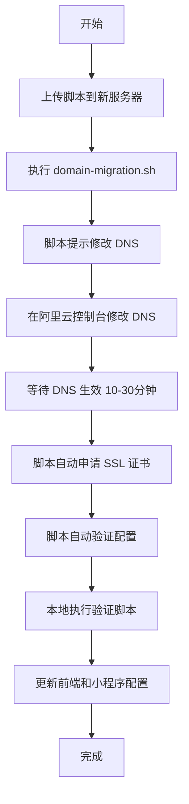

# 域名迁移文档索引

> **域名**: www.horsduroot.com  
> **目标服务器**: 121.199.173.244 (i-bp17y72dzkqcsby31sy3)  
> **旧服务器**: 60.205.124.67 (i-2ze7ncpvr0pvja23beht)  
> **文档创建时间**: 2025-10-19  
> **状态**: 📝 待执行

---

## 📚 完整文档清单

### 核心操作文档

| 文档                | 说明                              | 路径                                                                               | 推荐阅读顺序  |
| ------------------- | --------------------------------- | ---------------------------------------------------------------------------------- | ------------- |
| **快速开始指南** ⭐ | 一页纸快速版本，5 步完成切换      | [`QUICK-START-DOMAIN-MIGRATION.md`](./QUICK-START-DOMAIN-MIGRATION.md)             | 1️⃣ 优先阅读   |
| **完整操作指南**    | 详细的 7 步操作流程，包含所有细节 | [`domain-migration-guide.md`](./domain-migration-guide.md)                         | 2️⃣ 执行参考   |
| **前端配置更新**    | 前端和小程序配置修改指南          | [`frontend-miniprogram-config-update.md`](./frontend-miniprogram-config-update.md) | 3️⃣ 切换后执行 |

### 自动化脚本

| 脚本                | 功能                                   | 路径                                                                                           | 使用方式                          |
| ------------------- | -------------------------------------- | ---------------------------------------------------------------------------------------------- | --------------------------------- |
| **一键执行脚本** 🚀 | 自动完成服务器配置、SSL 证书申请、验证 | [`scripts/deploy/domain-migration.sh`](../../scripts/deploy/domain-migration.sh)               | `sudo bash domain-migration.sh`   |
| **验证测试脚本** 🧪 | 全面检测切换是否成功，生成测试报告     | [`scripts/deploy/verify-domain-migration.sh`](../../scripts/deploy/verify-domain-migration.sh) | `bash verify-domain-migration.sh` |

---

## 🚀 执行流程概览

### 方式一：使用自动化脚本（推荐）



**预计时间**: 1 小时（含 DNS 等待时间）

### 方式二：手动执行

按照 [`domain-migration-guide.md`](./domain-migration-guide.md) 文档的 7 个步骤逐一执行。

**预计时间**: 1.5-2 小时

---

## 📋 执行前准备清单

在开始切换前，确认以下信息：

- [ ] 新服务器后端服务运行正常 (`systemctl status wuhao-tutor.service`)
- [ ] 新服务器 Nginx 运行正常 (`systemctl status nginx`)
- [ ] 新服务器防火墙已开放 80/443 端口
- [ ] 拥有阿里云域名管理权限 (https://dns.console.aliyun.com/)
- [ ] 拥有微信小程序后台管理权限 (https://mp.weixin.qq.com/)
- [ ] 已备份重要数据和配置文件

---

## 🎯 关键操作步骤速查

### 1. DNS 解析修改（阿里云控制台）

**登录**: https://dns.console.aliyun.com/

**操作**: 找到域名 `horsduroot.com`，修改 A 记录

| 记录类型 | 主机记录 | 旧值          | 新值            | TTL |
| -------- | -------- | ------------- | --------------- | --- |
| A        | www      | 60.205.124.67 | 121.199.173.244 | 600 |
| A        | @        | 60.205.124.67 | 121.199.173.244 | 600 |

### 2. 执行自动化脚本（新服务器）

```bash
# 1. 上传脚本
scp scripts/deploy/domain-migration.sh root@121.199.173.244:/tmp/

# 2. SSH 登录
ssh root@121.199.173.244

# 3. 执行脚本
sudo bash /tmp/domain-migration.sh
```

### 3. 验证切换（本地 Mac）

```bash
# 本地执行验证脚本
bash scripts/deploy/verify-domain-migration.sh
```

### 4. 更新前端配置

```bash
# 编辑配置
vim frontend/.env.production
# 改为: VITE_API_BASE_URL=https://www.horsduroot.com

# 重新构建
cd frontend && npm run build

# 部署
scp -r dist/* root@121.199.173.244:/var/www/wuhao-tutor/frontend/
```

### 5. 更新小程序配置

```bash
# 编辑配置
vim miniprogram/config/index.js
# 改为: baseUrl: 'https://www.horsduroot.com'
```

### 6. 微信小程序后台配置

**登录**: https://mp.weixin.qq.com/

**路径**: 开发管理 → 开发设置 → 服务器域名

**添加**: `https://www.horsduroot.com`

---

## ⚠️ 重要提醒

### DNS 生效时间

- **正常情况**: 10-30 分钟
- **最长可能**: 24-48 小时（极少数情况）
- **加速方法**: TTL 设置为 600 秒，清除本地 DNS 缓存

### SSL 证书

- 脚本会自动使用 Let's Encrypt 申请免费证书
- 证书有效期 90 天，会自动续期
- 需要输入邮箱地址（用于到期提醒）

### 回滚方案

如果切换后出现严重问题，立即在阿里云控制台回滚 DNS：

```
www.horsduroot.com  →  60.205.124.67
horsduroot.com      →  60.205.124.67
TTL 改为 60 秒（加速生效）
```

### 旧服务器保留

- 建议保留 24-48 小时观察
- 确认无流量后再停止服务
- 备份配置文件后可释放资源

---

## ✅ 验收标准

切换完成后，逐项确认：

| 验收项              | 验证方法                                           | 状态 |
| ------------------- | -------------------------------------------------- | ---- |
| DNS 解析正确        | `nslookup www.horsduroot.com` 返回 121.199.173.244 | [ ]  |
| HTTP 自动跳转 HTTPS | `curl -I http://www.horsduroot.com` 返回 301/302   | [ ]  |
| HTTPS 访问正常      | 浏览器访问，无证书警告                             | [ ]  |
| API 健康检查        | `curl https://www.horsduroot.com/health` 返回 200  | [ ]  |
| 前端页面加载        | 浏览器访问首页正常显示                             | [ ]  |
| 用户登录功能        | 测试登录流程                                       | [ ]  |
| 作业问答功能        | 测试 AI 对话                                       | [ ]  |
| 图片上传功能        | 测试上传图片                                       | [ ]  |
| 小程序访问          | 打开小程序测试                                     | [ ]  |
| SSL 证书有效        | 证书有效期 >30 天                                  | [ ]  |
| 错误日志正常        | 检查最近 1 小时日志                                | [ ]  |
| 旧服务器流量        | 24 小时后接近 0                                    | [ ]  |

---

## 📞 问题排查

### 常见问题速查

| 问题             | 原因                   | 解决方案               | 文档位置          |
| ---------------- | ---------------------- | ---------------------- | ----------------- |
| DNS 解析未生效   | DNS 缓存或配置错误     | 清除本地缓存，检查配置 | 完整指南 - 问题 1 |
| SSL 证书申请失败 | DNS 未生效或端口未开放 | 确认 DNS，开放 80 端口 | 完整指南 - 问题 2 |
| 小程序域名不合法 | 微信后台未配置         | 添加域名，等待 5 分钟  | 前端配置 - 问题 2 |
| CORS 错误        | 后端 CORS 配置未更新   | 修改 `.env.production` | 前端配置 - 问题 4 |
| 前端静态资源 404 | Nginx 配置错误         | 检查静态文件路径       | 前端配置 - 问题 3 |

---

## 📊 文件清单

### 新生成的文件

```
docs/deployment/
├── domain-migration-guide.md              # 完整操作指南 (637 行)
├── QUICK-START-DOMAIN-MIGRATION.md        # 快速开始指南 (151 行)
├── frontend-miniprogram-config-update.md  # 前端配置更新 (455 行)
└── DOMAIN_MIGRATION_INDEX.md              # 本文档

scripts/deploy/
├── domain-migration.sh                    # 一键执行脚本 (358 行)
└── verify-domain-migration.sh             # 验证测试脚本 (332 行)
```

### 需要修改的配置文件

```
新服务器 (121.199.173.244):
├── /etc/nginx/sites-available/wuhao-tutor.conf  # Nginx 配置
├── /opt/wuhao-tutor/.env.production              # 后端配置
└── /etc/letsencrypt/                             # SSL 证书目录

本地项目:
├── frontend/.env.production                      # 前端配置
└── miniprogram/config/index.js                   # 小程序配置

微信小程序后台:
└── 服务器域名配置 (https://mp.weixin.qq.com/)
```

---

## 🔄 后续操作提醒

### 切换完成后 24 小时内

- [ ] 监控错误日志：`tail -f /var/log/nginx/error.log`
- [ ] 检查旧服务器流量：`tail /var/log/nginx/access.log`
- [ ] 测试所有核心功能
- [ ] 收集用户反馈

### 切换完成后 48 小时

- [ ] 确认旧服务器无流量
- [ ] 备份旧服务器配置文件
- [ ] 停止旧服务器服务（可选）

### 切换完成后 1 周

- [ ] 释放旧服务器资源（如不再需要）
- [ ] 更新项目文档中的服务器信息
- [ ] 归档切换日志和记录

---

## 📝 执行记录模板

### 切换执行记录

复制以下模板记录执行情况：

```markdown
## 域名切换执行记录

**执行时间**: YYYY-MM-DD HH:MM

### 执行步骤

- [ ] DNS 解析修改（开始时间：\_**\_，完成时间：\_\_**）
- [ ] 脚本执行（开始时间：\_**\_，完成时间：\_\_**）
- [ ] DNS 生效验证（生效时间：\_\_\_\_）
- [ ] SSL 证书申请（颁发时间：\_**\_，到期时间：\_\_**）
- [ ] 功能验证（通过率：\_\_\_\_）
- [ ] 前端配置更新（完成时间：\_\_\_\_）
- [ ] 小程序配置更新（完成时间：\_\_\_\_）

### 遇到的问题

1. 问题描述：\_**\_
   解决方案：\_\_**
   耗时：\_\_\_\_

### 验证结果

- 通过项：\_\_\_\_ / 12
- 失败项：\_\_\_\_ / 12
- 警告项：\_\_\_\_ / 12

### 备注

---
```

---

## 🎓 学习资源

### 相关技术文档

- [Nginx 配置指南](https://nginx.org/en/docs/)
- [Let's Encrypt 使用文档](https://letsencrypt.org/docs/)
- [阿里云 DNS 解析文档](https://help.aliyun.com/document_detail/29716.html)
- [微信小程序服务器域名配置](https://developers.weixin.qq.com/miniprogram/dev/framework/ability/network.html)

### 项目相关文档

- [生产环境部署指南](./production-deployment-guide.md)
- [本地代码验证](./local-code-verification.md)
- [安全密钥管理](./SECURITY_KEYS_GUIDE.md)

---

## 📅 最佳执行时间建议

### 推荐时间段

- ✅ **周末或法定节假日** - 用户访问量低
- ✅ **凌晨 2:00 - 5:00** - 系统负载最低
- ✅ **非业务高峰期** - 避免影响用户体验

### 避免时间段

- ❌ 工作日白天
- ❌ 节假日前夕
- ❌ 重要发布或活动期间

---

## 💡 额外建议

1. **提前通知**: 如有用户群，提前通知可能的短暂中断
2. **分步执行**: 可以先完成服务器配置，择期修改 DNS
3. **灰度切换**: 如有条件，可以先用测试域名验证
4. **双活准备**: 在 DNS 完全生效前，新旧服务器同时运行

---

## ✨ 总结

### 准备完成清单

- ✅ 完整操作文档（3 份，1933 行）
- ✅ 自动化脚本（2 个，690 行）
- ✅ 验证测试方案（8 项测试）
- ✅ 问题排查指南（5 大类问题）
- ✅ 紧急回滚方案（1 分钟回滚）

### 下一步行动

当你准备好执行域名切换时：

1. **阅读** [`QUICK-START-DOMAIN-MIGRATION.md`](./QUICK-START-DOMAIN-MIGRATION.md)（5 分钟）
2. **准备** 确认执行前检查清单（10 分钟）
3. **执行** 运行自动化脚本（30 分钟）
4. **验证** 完整功能测试（15 分钟）
5. **观察** 监控运行状态（24-48 小时）

---

**文档版本**: v1.0  
**创建时间**: 2025-10-19  
**创建者**: AI Assistant  
**维护者**: liguoma

**祝你切换顺利！🚀**
