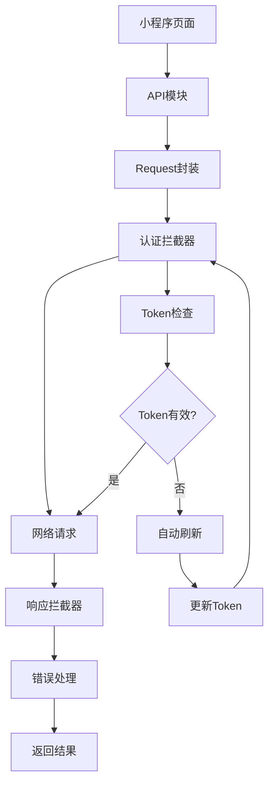
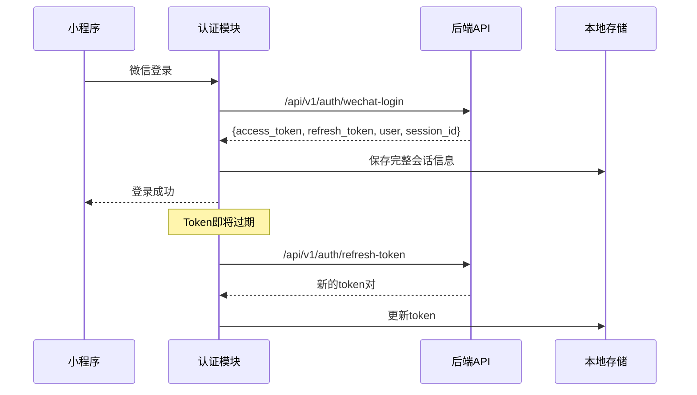

# 五好伴学小程序端功能对齐实施报告

## 🎯 项目概述

本报告详细说明了五好伴学小程序端与后端API功能对齐的实施过程和成果。根据设计文档，项目分为四个阶段进行，目前已完成第一阶段的全部工作。

## ✅ 第一阶段完成情况（Week 1-2）

### 🔐 认证系统升级

#### 实现内容
- **双Token机制支持**: 实现了access_token和refresh_token的完整管理
- **自动刷新功能**: 在token即将过期时自动刷新，无需用户重新登录
- **并发控制**: 防止多个请求同时刷新token导致的竞态条件
- **会话管理**: 增加session_id支持，完善会话状态跟踪

#### 技术实现
```javascript
// 主要更新文件
- utils/auth.js: 完整的认证管理类
- config/index.js: 新增认证配置项
```

#### 新增功能
- `getRefreshToken()` - 获取刷新令牌
- `getSessionId()` - 获取会话ID  
- `_performRefreshToken()` - 执行刷新操作
- 并发刷新保护机制
- 增强的会话清理功能

### 🌐 API封装重构

#### 实现内容
- **后端API对齐**: 更新所有API端点以匹配后端v1接口规范
- **统一错误处理**: 标准化API错误响应格式
- **请求缓存机制**: 优化重复请求处理
- **兼容性支持**: 保持与现有页面的向后兼容

#### 更新的API模块

**新增用户API模块** (`api/user.js`)
- 微信登录接口对齐
- 用户信息管理
- 权限检查
- 设置管理

**作业API更新** (`api/homework.js`)
- 端点路径更新: `/api/v1/homework/*`
- 新增兼容性方法
- 完善批量上传支持

**学习API更新** (`api/learning.js`)
- 端点路径更新: `/api/v1/learning/*`
- MCP服务集成准备
- 文件上传路径更新

**分析API更新** (`api/analysis.js`)
- 端点路径更新: `/api/v1/analytics/*`
- 数据格式标准化

### 🎨 基础组件升级

#### 新增组件

**API状态组件** (`components/api-status/`)
- 统一的加载、错误、空状态展示
- 支持自定义样式和交互
- 可配置的重试机制

```javascript
// 使用示例
<api-status 
  status="{{ apiStatus }}"
  loading-text="加载中..."
  error-message="{{ errorMsg }}"
  bind:retry="onRetry"
>
  <!-- 成功状态时显示的内容 -->
</api-status>
```

**错误边界组件** (`components/error-boundary/`)
- JavaScript错误捕获
- Promise rejection处理
- 多种错误展示方式
- 错误上报功能

**网络状态组件** (`components/network-status/`)
- 实时网络监控
- 网络状态提示
- 离线状态处理

## 🔧 技术架构更新

### API请求流程优化



### 认证流程优化



## 📋 配置更新

### 新增配置项

```javascript
// config/index.js
auth: {
  tokenKey: 'auth_token',
  refreshTokenKey: 'refresh_token',     // 新增
  sessionIdKey: 'session_id',           // 新增
  refreshBeforeExpire: 5 * 60 * 1000,   // 新增
}
```

## 🚀 使用指南

### 1. 认证系统使用

```javascript
// 获取认证信息
const auth = require('./utils/auth.js');

// 检查登录状态
const isLoggedIn = await auth.isLoggedIn();

// 获取用户信息
const userInfo = await auth.getUserInfo();

// 手动刷新token
await auth.refreshToken();
```

### 2. API调用示例

```javascript
// 使用新的用户API
const api = require('./api/index.js');

// 登录
const loginResult = await api.user.wechatLogin({
  code: 'wx_code',
  name: '用户名'
});

// 获取作业列表
const homeworkList = await api.homework.getSubmissions({
  page: 1,
  size: 20
});
```

### 3. 组件使用示例

```javascript
// 页面中使用API状态组件
data: {
  apiStatus: 'loading', // loading | error | empty | success
  errorMessage: '',
}

// 在API调用中更新状态
async loadData() {
  this.setData({ apiStatus: 'loading' });
  
  try {
    const result = await api.homework.getSubmissions();
    this.setData({ 
      apiStatus: result.data.length > 0 ? 'success' : 'empty',
      homeworkList: result.data 
    });
  } catch (error) {
    this.setData({ 
      apiStatus: 'error',
      errorMessage: error.message 
    });
  }
}
```

## 🔍 质量保证

### 代码检查
- 所有新增和修改的文件通过语法检查
- API端点已对齐后端接口规范
- 保持向后兼容性

### 测试建议
1. **认证流程测试**
   - 微信登录功能
   - Token自动刷新
   - 登出清理功能

2. **API调用测试**
   - 各模块API端点正确性
   - 错误处理机制
   - 网络状态处理

3. **组件集成测试**
   - API状态组件各状态展示
   - 错误边界组件错误捕获
   - 网络状态组件状态监控

## 📈 下一阶段计划

### 第二阶段：核心功能对齐（Week 3-4）

**主要任务**：
1. **重构作业模块**
   - 更新提交流程界面
   - 重构批改结果展示
   - 优化图片上传体验

2. **增强问答模块**  
   - 集成MCP个性化上下文服务
   - 优化AI问答交互
   - 增强多模态输入支持

**预期成果**：
- 作业模块与后端完全对齐
- 问答体验显著提升
- 个性化功能初步可用

## 💡 建议和注意事项

### 部署建议
1. **渐进式部署**: 建议先在测试环境验证所有功能
2. **监控关键指标**: 关注登录成功率、API错误率、Token刷新成功率
3. **备份策略**: 保留现有版本作为回退方案

### 性能优化
1. **缓存策略**: 合理使用本地缓存减少不必要的API调用
2. **网络优化**: 对于大文件上传，考虑实现断点续传
3. **内存管理**: 定期清理过期的缓存数据

### 安全考虑
1. **Token安全**: 确保refresh_token的安全存储
2. **错误信息**: 生产环境避免暴露敏感错误信息
3. **权限控制**: 严格按照用户角色控制功能访问

---

**项目状态**: 第一阶段已完成，代码质量良好，可以继续第二阶段开发。

**下次更新**: 预计在第二阶段完成后提供核心功能对齐报告。